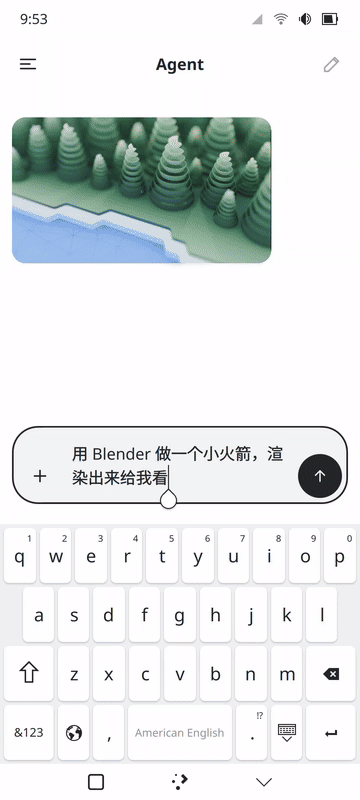
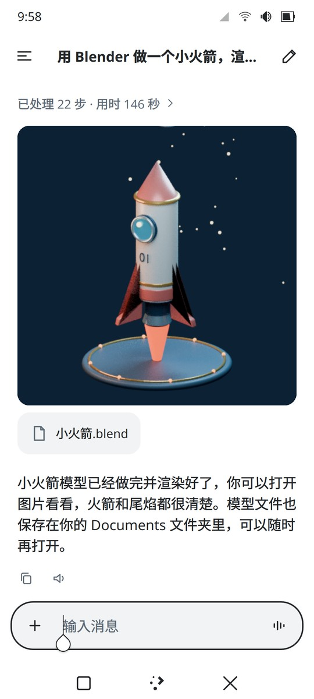
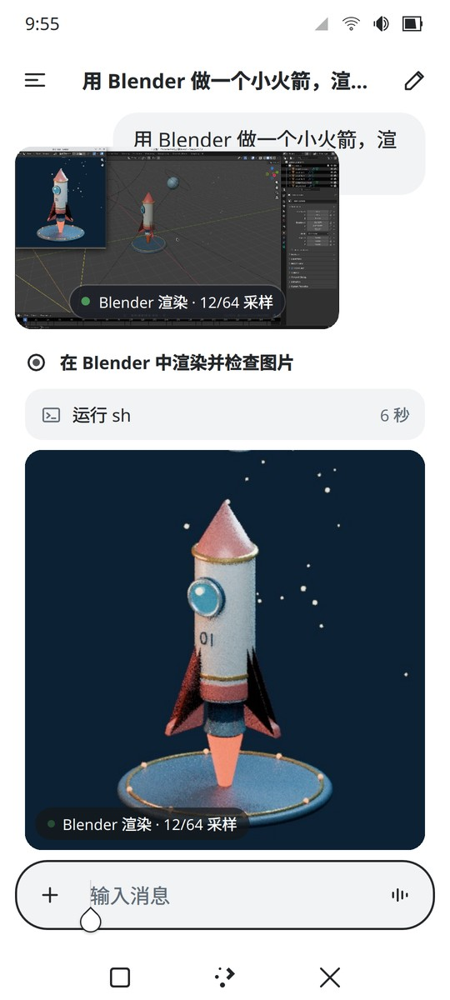
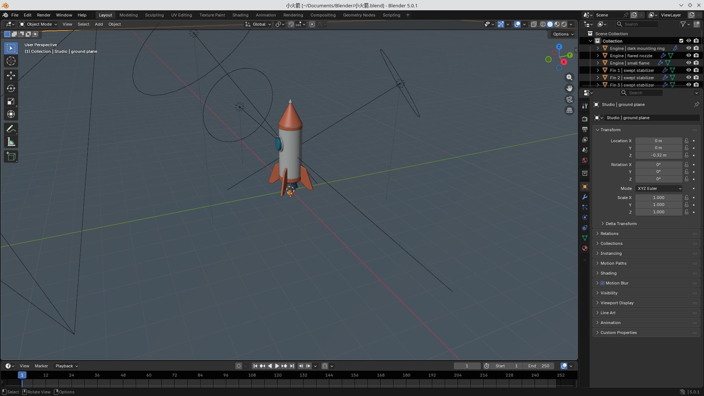
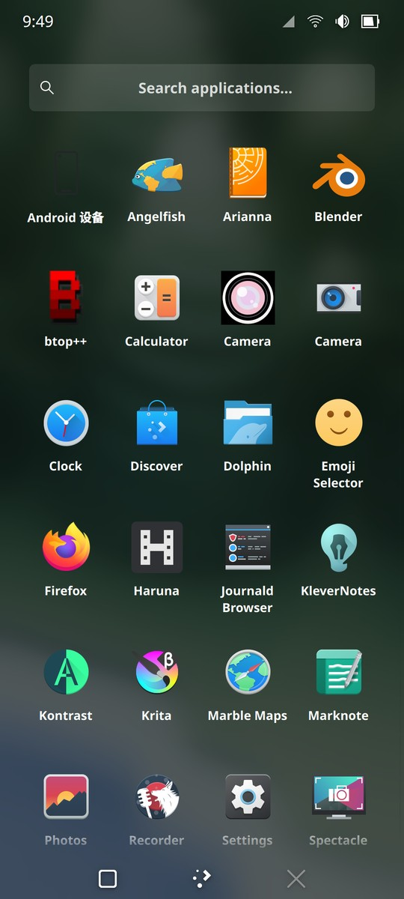
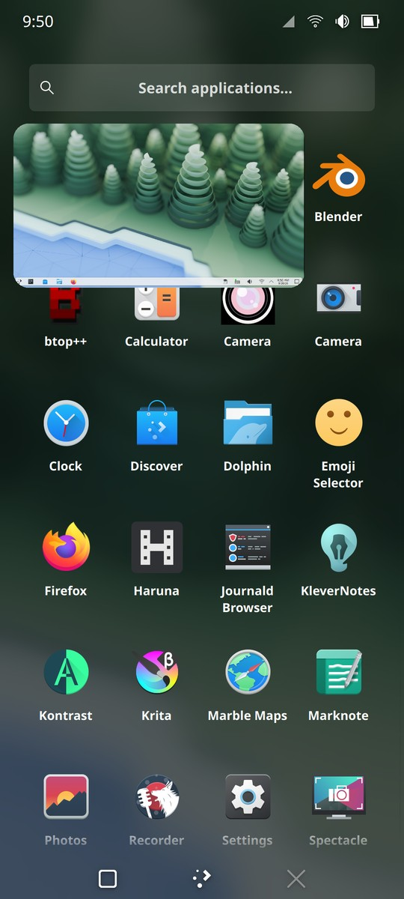
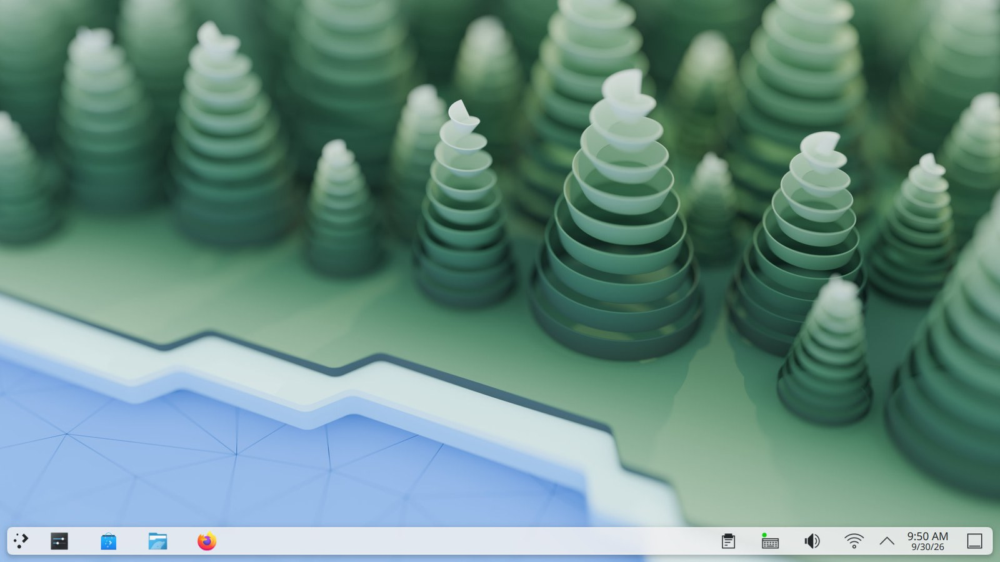
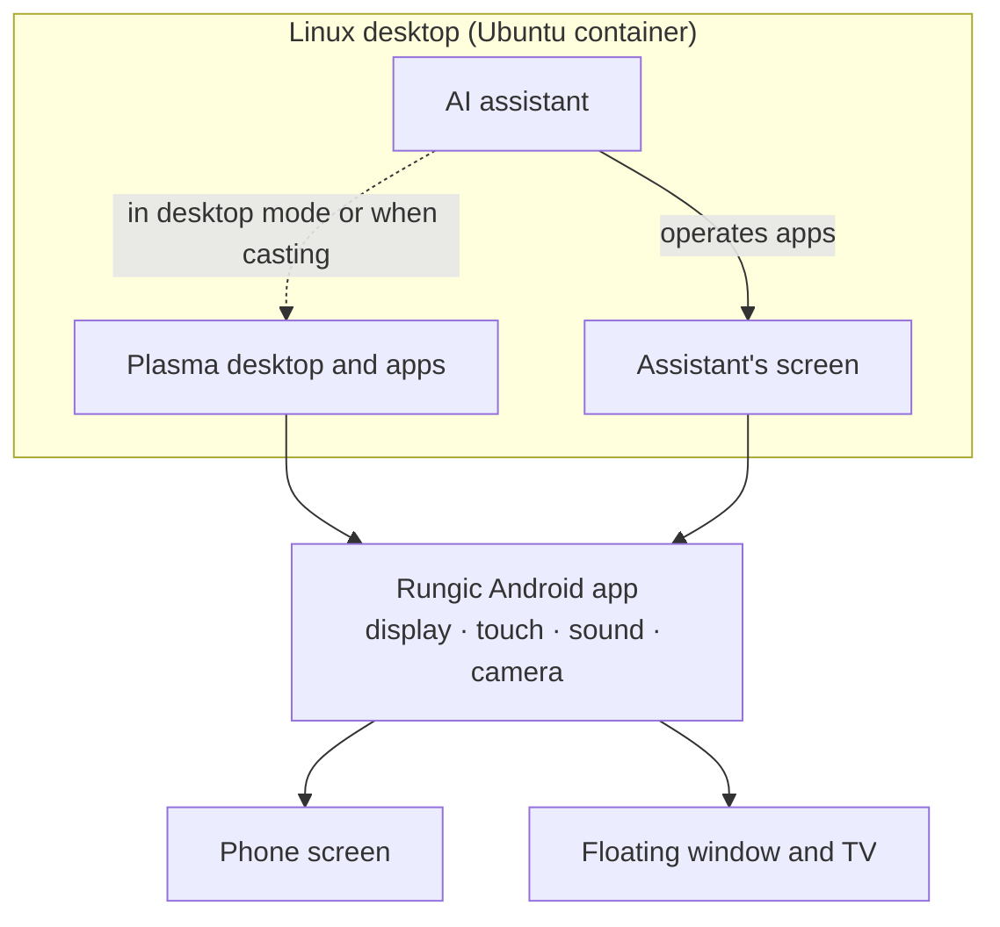

<h1 align="center">Rungic</h1>

<strong>AgentOS in your hand.</strong>

An Android phone, a full Linux desktop computer, and an assistant that does the work for you.

  

“Make a little rocket in Blender and render it for me.” The whole task took 2½ minutes; shown here sped up.

Rungic turns a phone into a real computer. It opens to the KDE Plasma desktop and runs desktop software such as Firefox, Blender, Krita and VS Code. Connect a TV and it becomes a desktop PC.

It also comes with an AI assistant that can see, speak and act. Tell it what you need, and it opens the apps and gets the job done while you watch.

## Just say it

<table>
<tr>
<td>

Hold the Home button and ask:

> “Make a little rocket in Blender and render it for me.”
>
> “Install Krita for me.”
>
> “Put your screen on the TV.”
>
> “Send Mom a WeChat voice message: I'll be home for dinner.”

The assistant lays out a plan first and tells you out loud how it is going. It opens apps, clicks buttons and types for you. When it is done, the pictures and files it made land right in the conversation, ready to open.

</td>
<td width="260">

</td>
</tr>
</table>

## The assistant has its own screen

<table>
<tr>
<td width="260">

</td>
<td>

The assistant works on a desktop of its own, so your phone stays yours.

- Its screen floats in a small window you can resize, tuck against the edge, or send to the TV with one sentence.
- Its clicks and typing happen only on its own screen. Keep using your phone meanwhile.
- When you have desktop mode on or are casting to a TV, it works right there on your desktop with you. You can also tell it where to work.

</td>
</tr>
</table>

  

The assistant's screen at full size: Blender with the rocket it just built.

## You stay in control

- **It asks first.** Before it closes an app you are using, deletes or overwrites your files, or sends a message, it asks you.
- **Your password stays yours.** When something needs administrator rights, the system shows a password dialog on your screen. You type it; the assistant never sees it.
- **No silent detours.** If the plan hits a wall, it explains the options and what each one means, and you choose. It does not quietly settle for less.
- **You set the rules.** The assistant's guidelines and skills are plain text files in your home folder. Edit them and the change applies right away.

## A real computer in your pocket

- **A complete Linux desktop.** Ubuntu 26.04 with KDE Plasma Mobile 6.6. Install software with apt, Flatpak or the Discover app store.
- **GPU acceleration.** The desktop, the browser and 3D software all run on the phone's GPU, including older X11 programs and Flatpak apps. Video decoding runs in hardware.
- **Your phone's hardware.** Speaker, microphone, front and rear cameras, a clipboard shared with Android, and Chinese input with Rime.
- **Desktop mode and casting.** Open the full desktop in a floating window, or cast it wirelessly to a TV and use the phone as its touchpad and keyboard.
- **Smooth.** Frames go straight to the display without copying, at up to 120 Hz while you touch the screen.
- **Looks after itself.** A home-screen widget spots problems on the system and hands them to the assistant to investigate.

<table>
<tr>
<td align="center"> Desktop apps on the phone</td>
<td align="center"> Desktop mode in a floating window</td>
</tr>
</table>

  

The same desktop on a TV or in the floating window.

## How it works

Rungic does not replace the phone's operating system. Android keeps handling calls, networking, the camera and the rest of the hardware. The Linux desktop runs in a container, and the Rungic app ties together its picture, touch input, sound and camera.

The assistant has two parts: a realtime voice model talks with you, and an agent in the background does the work.

## Supported devices

| Device | Status |
|---|---|
| moto g100s (XT2537-4) | Main development device, most complete |
| moto g100 (XT2533-4) | One-step flash package verified on a wiped phone |
| moto X70 Air Pro | In progress |

## Status

Rungic is under active development and in private preview. Still being polished:

- The assistant speaks Chinese and its interface is in Chinese for now.
- Larger tasks, such as modelling in 3D, take the assistant about two minutes; work to speed this up is under way.
- The call agent, which makes and answers phone calls for you, is still being tested.
- Vulkan desktop rendering flickers on this GPU family, so the desktop uses OpenGL ES for now.

## Learn more

- [Developer guide and documentation index](docs/README.md): repository layout, development entry points, and the design and acceptance documents for each capability
- [Voice assistant](docs/59-voice-agent.md) · [Computer use](docs/60-computer-use.md) · [Assistant's screen](docs/65-agent-screen.md) · [Agent workspaces](docs/research/91-agent-workspaces.md) (in Chinese)
- [Engineering conventions](AGENTS.md) (in Chinese)
