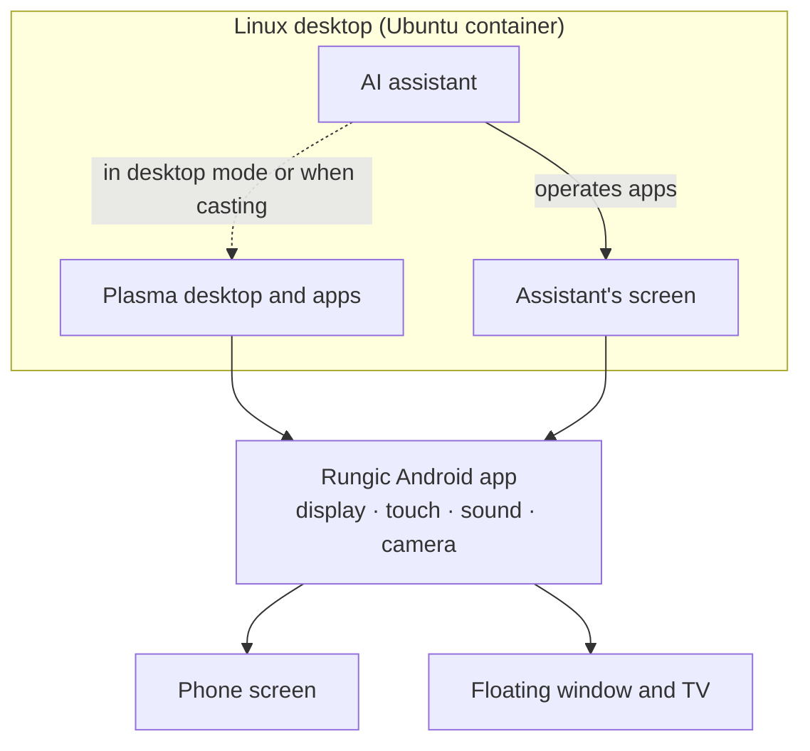

<h1 align="center">Rungic</h1>

<p align="center"><strong>AgentOS in your hand.</strong></p>

<p align="center">An Android phone, a full Linux desktop computer, and an assistant that does the work for you.</p>

<p align="center">
  
</p>

<p align="center"><sub>“Make a little rocket in Blender and render it for me.” The whole task took about 2½ minutes; shown here sped up.</sub></p>

Rungic turns a phone into a real computer. It opens to the KDE Plasma desktop and runs desktop software such as Firefox, Blender, Krita and VS Code. Connect a TV and it becomes a desktop PC.

It also comes with an AI assistant that can see, speak and act. Tell it what you need, and it opens the apps and gets the job done while you watch.

## Still your Android phone

Rungic is an app. Install the APK, tap its icon, and the Linux desktop opens.

You don't give anything up for it. Android is not wiped or replaced: your apps, calls, messages, photos and accounts stay where they are, and you can switch back to them at any time. The desktop and Android run side by side, sharing the clipboard and your photos, videos and downloads.

## Just say it

<table>
<tr>
<td>

Hold the Home button and ask:

> “Make a little rocket in Blender and render it for me.”
>
> “Install Krita for me.”
>
> “Put your screen on the TV.”
>
> “Send Mom a WeChat voice message: I'll be home for dinner.”

The assistant lays out a plan first and tells you out loud how it is going. It opens apps, clicks buttons and types for you. When it is done, the pictures and files it made land right in the conversation, ready to open.

</td>
<td width="260">

</td>
</tr>
</table>

## The assistant has its own screen

<table>
<tr>
<td width="260">

</td>
<td>

The assistant works on a desktop of its own, so your phone stays yours.

- Its screen floats in a small window you can resize, tuck against the edge, or send to the TV with one sentence.
- Its clicks and typing happen only on its own screen. Keep using your phone meanwhile.
- When you have desktop mode on or are casting to a TV, it works right there on your desktop with you. You can also tell it where to work.

</td>
</tr>
</table>

<p align="center">
  
</p>

<p align="center"><sub>The assistant's screen at full size: Blender with the rocket it just built.</sub></p>

## You stay in control

- **It asks first.** Before it closes an app you are using, deletes or overwrites your files, or sends a message, it asks you.
- **Your password stays yours.** When something needs administrator rights, the system shows a password dialog on your screen. You type it; the assistant never sees it.
- **No silent detours.** If the plan hits a wall, it explains the options and what each one means, and you choose. It does not quietly settle for less.
- **You set the rules.** The assistant's guidelines and skills are plain text files in your home folder. Edit them and the change applies right away.

## A real computer in your pocket

- **A complete Linux desktop.** Ubuntu 26.04 with KDE Plasma Mobile 6.6. Install software with apt, Flatpak or the Discover app store.
- **GPU acceleration.** The desktop, the browser and 3D software all run on the phone's GPU, including older X11 programs and Flatpak apps. Video decoding runs in hardware.
- **Your phone's hardware.** Speaker, microphone, front and rear cameras, a clipboard shared with Android, and Chinese input with Rime.
- **Desktop mode and casting.** Open the full desktop in a floating window, or cast it wirelessly to a TV and use the phone as its touchpad and keyboard.
- **Smooth.** Frames go straight to the display without copying, at up to 120 Hz while you touch the screen.
- **Looks after itself.** A home-screen widget spots problems on the system and hands them to the assistant to investigate.

<table>
<tr>
<td align="center"><br><sub>Desktop apps on the phone</sub></td>
<td align="center"><br><sub>Desktop mode in a floating window</sub></td>
</tr>
</table>

<p align="center">
  
</p>

<p align="center"><sub>The same desktop on a TV or in the floating window.</sub></p>

## How it works



Rungic does not replace the phone's operating system. Android keeps handling calls, networking, the camera and the rest of the hardware. The Linux desktop runs in a container, and the Rungic app ties together its picture, touch input, sound and camera.

The assistant has two parts: a realtime voice model talks with you, and an agent in the background does the work.

## Supported devices

| Device | Status |
|---|---|
| moto g100s (XT2537-4) | Main development device, most complete |
| moto g100 (XT2533-4) | One-step flash package verified on a wiped phone |
| moto X70 Air Pro | In progress |

## Status

Rungic is under active development and in private preview. Still being polished:

- The interface follows the desktop's language (English and Chinese so far), and the assistant answers in the language you speak to it. Account setup and some technical documents are still in Chinese.
- Larger tasks, such as modelling in 3D, take the assistant about two minutes; work to speed this up is under way.
- The call agent, which makes and answers phone calls for you, is still being tested.
- Vulkan desktop rendering flickers on this GPU family, so the desktop uses OpenGL ES for now.

## Skills

Skills are reusable instructions that an agent reads to carry out a task. This repository includes two:

| Skill | Where to use it | What it does |
|---|---|---|
| [`rungic-three-stage-image`](.agents/skills/rungic-three-stage-image/SKILL.md) | Codex working in this repository | Builds the device's GKI kernel, the RungicOS Linux image and the complete flash package. Covers individual stages, device bring-up, installation and acceptance. |
| [`rungic-phone-desktop`](plasma/voice-agent/skills/rungic-phone-desktop/SKILL.md) | The assistant running on the phone | Operates desktop apps and windows, controls phone functions, casts to a TV and handles supported call workflows. |

The desktop skill ships with the assistant. Its editable copy lives at `~/.codex/skills/rungic-phone-desktop/` on the phone; changes you make there are preserved when the package updates.

### Choose what to build and install

Invoke `$rungic-three-stage-image` in Codex from the repository root, and specify the device/firmware [spec](profiles/devices/), the work you want done and whether installation is included. The same skill supports the full workflow or a selected stage:

| Your goal | Build scope and output | Installation path |
|---|---|---|
| **Build a complete phone release** | **CI1 → CI2 → CI3:** GKI/boot, RungicOS rootfs, then the device flash package with Android partitions, APK, first-boot components, checksums and installer. | Use the generated package's installer for the matching device. Complete-release acceptance includes a wiped install, account setup and reaching Plasma. |
| **Build the kernel only** | **CI1:** the spec's pinned kernel sources, configuration and patches; produces GKI/boot and ABI/module-trust reports. | Use the target device's verified boot/flash procedure and validate the candidate on that device. |
| **Build the Linux system image only** | **CI2:** install the selected package release in a clean ARM64 root tree; produce ext4 rootfs, compressed seed, package lock and report. | Feed it into a matching device installation package. For updates to an existing installation, use the package-update path below. |
| **Assemble a package from existing builds** | **CI3:** reuse verified kernel/rootfs artifacts and the exact OEM firmware inputs; assemble and check the device package. | Use the generated installer. Existing artifacts must match the selected spec and their recorded checksums. |
| **Update desktop or Agent components on an installed phone** | Build the changed packages and a versioned APT release; keep the compatible kernel and Android base. | Deploy through [`rungic_release.py`](tools/rungic_release.py), reload affected services/UI and run the relevant acceptance checks. |

Example requests for Codex — replace the placeholders with your chosen inputs:

```text
Use $rungic-three-stage-image to build a complete Rungic flash package
for <device-spec>. Deliver the package, checksums and offline validation report.

Use $rungic-three-stage-image to run CI1 only for <device-spec>.
Build the kernel/boot candidate and check its OEM module compatibility.

Use $rungic-three-stage-image to run CI2 only for <device-spec>, using
<package-release>. Produce a clean RungicOS rootfs image and package lock.

Use $rungic-three-stage-image to run CI3 for <device-spec>, reusing
<verified-kernel-artifacts> and <verified-rootfs-artifacts>.

Use $rungic-three-stage-image to install <prepared-release> on
<device-serial>. A full wipe is intended. Verify first boot and account
setup through to the Plasma desktop.
```

For installation, name the exact artifact and target device/serial, and state whether a full wipe is intended. A build-only request produces artifacts; it does not flash the phone. Kernel and rootfs stages can be rebuilt independently when the existing components remain compatible. The Linux rootfs shares Android's kernel and is a container filesystem image, not an Android `system.img`.

For incremental work, a request such as “Build and deploy the updated suggestion widget to my existing Rungic installation on `<device-serial>`, then verify its desktop interactions” selects the package-update path. Project packages use [`rungic_package.py`](tools/rungic_package.py); modified upstream packages use [`build_on_device.py`](tools/build_on_device.py).

These skills guide the existing build tools; the complete process still involves several tools and device-specific inputs. In particular, [`build_rootfs_image.py`](tools/ci/build_rootfs_image.py) packages an already prepared root tree and checks its package versions. See the [tool map](.agents/skills/rungic-three-stage-image/references/tool-map.md) for stage entry points, [new-device guide](.agents/skills/rungic-three-stage-image/references/device-onboarding.md) for adaptation, and [first-boot guide](.agents/skills/rungic-three-stage-image/references/first-boot.md) for installation and recovery. The [G100 acceptance record](docs/80-g100-image-installation-retrospective.md) documents the verified full-install path; other device/firmware combinations need their own validation. These detailed engineering guides are currently in Chinese.

## Learn more

- [Developer guide and documentation index](docs/README.md): repository layout, development entry points, and the design and acceptance documents for each capability
- [Voice assistant](docs/59-voice-agent.md) · [Computer use](docs/60-computer-use.md) · [Assistant's screen](docs/65-agent-screen.md) · [Agent workspaces](docs/research/91-agent-workspaces.md) (in Chinese)
- [Engineering conventions](AGENTS.md) (in Chinese)
