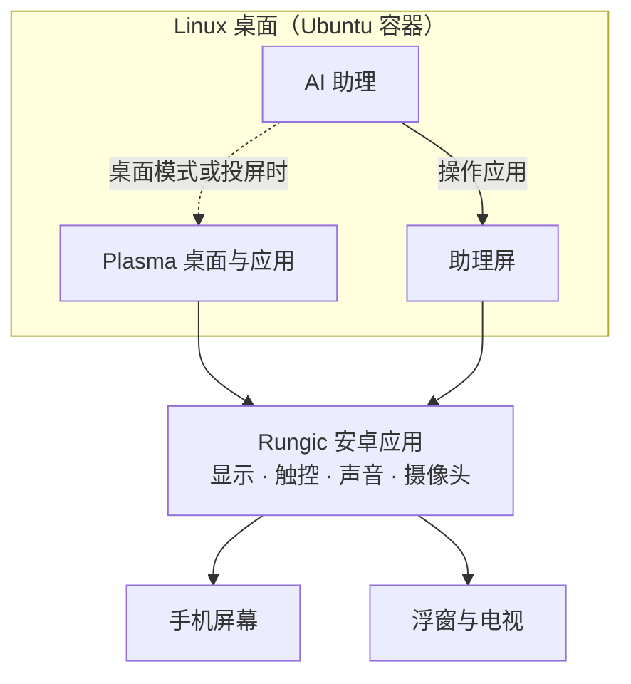

# Rungic

**口袋里的 AI 电脑。** 一部安卓手机，一台完整的 Linux 桌面电脑，外加一个会替你动手的助理。

Rungic 把手机变成真正的电脑：打开就是 KDE Plasma 桌面，跑的是 Firefox、Blender、Krita、VS Code 这些桌面软件；连上电视，它就是一台台式机。

更重要的是，它自带一个能看、能说、能动手的 AI 助理。你说要什么，它就打开软件把事情做完，整个过程你都看得见。

## 说一句话，事情就办好

长按 Home 键，直接说出你要的：

> “用 Blender 做一个小火箭，渲染出来给我看。”
>
> “帮我装一个 Krita。”
>
> “把你的屏幕投到电视上。”
>
> “用微信给妈妈发条语音，说我今晚回家吃饭。”

助理会先列出计划，边做边用语音告诉你进展。它会打开软件、点按钮、输入文字，做完把图片和文件直接放进对话里，点开就能看。

## 助理有自己的屏幕

助理在自己的桌面上工作，不会抢你的手机。

- 它的屏幕显示在一个浮窗里，可以放大、缩小、收到屏幕边缘，也可以一句话投到电视上。
- 它的点击和输入只发生在自己的屏幕上，你照常用手机。
- 当你打开了桌面模式或正在投屏，它就直接在你的桌面上和你一起干活。你也可以指定它在哪里做。

## 你始终说了算

- **先问再动**：要关掉你正在用的应用、删除或覆盖你的文件、发送消息之前，它都会先问你。
- **密码只归你**：需要管理员权限时，系统会在你的屏幕上弹出密码框，由你自己输入，助理看不到密码。
- **不擅自绕路**：原计划走不通时，它会说明各个方案的后果，由你来选，不会悄悄降级了事。
- **规矩你来定**：助理的行为准则和技能就是你目录里的几个文本文件，改完立刻生效。

## 一部手机，一台真正的电脑

- **完整的 Linux 桌面**：Ubuntu 26.04 加 KDE Plasma Mobile 6.6，apt、Flatpak 和 Discover 应用商店都能直接用。
- **GPU 加速**：桌面、浏览器和 3D 软件都用上手机的 GPU，老式 X11 程序和 Flatpak 应用也不例外；视频硬件解码。
- **手机硬件都能用**：扬声器、麦克风、前后摄像头，和安卓互通的剪贴板，Rime 中文输入。
- **桌面模式与投屏**：在手机浮窗里打开完整桌面，或者无线投到电视，手机就是触控板和键盘。
- **流畅**：画面不经拷贝直接送上屏幕，触摸时最高 120Hz 刷新。
- **主动关照**：主屏的建议小组件会发现系统里的问题，一键交给助理调查处理。

## 它是怎么工作的

Rungic 不替换手机系统。安卓继续负责通话、网络和相机等硬件，Linux 桌面运行在容器里，由 Rungic 应用把画面、触控、声音和摄像头接在一起。

AI 助理由两部分组成：实时语音模型负责和你对话，后台的 Agent 负责真正干活。

## 支持的设备

| 设备 | 状态 |
|---|---|
| moto g100s（XT2537-4） | 主力开发设备，功能最全 |
| moto g100（XT2533-4） | 一键刷机包已验证，可清数据安装 |
| moto X70 Air Pro | 适配中 |

## 现状

Rungic 正在快速开发中，目前是私有预览版。尚在打磨的部分：

- 助理完成较复杂的任务（比如一次 3D 建模）大约需要两分钟，提速方案已经在做；
- 替你打电话、接电话的通话代理还在实测；
- Vulkan 桌面渲染在这类 GPU 上有闪屏，桌面暂时使用 OpenGL ES。

## 了解更多

- [开发者指南与文档索引](docs/README.md)：仓库结构、开发入口、每项能力的设计与验收文档
- [语音助理](docs/59-voice-agent.md) · [电脑操作](docs/60-computer-use.md) · [助理屏](docs/65-agent-screen.md) · [助理的工作区](docs/research/91-agent-workspaces.md)
- [工程约定](AGENTS.md)
