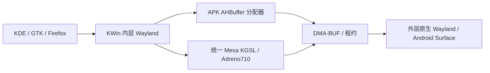

# Ubuntu Plasma Mobile：桌面与 Android 后端集成

2026-09-23，moto g100s / XT2537-4，Android 16，ARM64，Adreno 710。

**已实际部署独立 Ubuntu 26.04 LTS / Plasma Mobile 6.6.5 桌面，使用 glibc Mesa KGSL、定制 KWin 6.6.6 和 Android APK 1.4。中文输入已改为 Plasma Keyboard + Rime。** Phosh 保留独立容器、APK 和用户目录；没有刷 ROM。下文区分实际验收和仍存在的边界。

用户允许 Plasma 6.5 或更新稳定版。发行版选型见 [38 篇](38-plasma-mobile.md)，既有后端架构见 [31 篇](research/31-backend-integration.md)，输入法故障与改造见 [41 篇](41-plasma-rime-input.md)。早期实施进度保存在 `.work/refs/plasma-mobile-20260923/progress-1427.md`，不能用其中的“待构建”判断当前状态。

## 来源、版本和隔离

| 组件 | 本轮状态/版本 |
|---|---|
| Ubuntu minimal ARM64 | 26.04.1，20260908构建，已部署 |
| Plasma Mobile | 6.6.5-0ubuntu0.1，Ubuntu官方稳定更新 |
| KWin、Plasma Workspace、Keyboard | 6.6.6-0ubuntu0.1；KWin定制版本为+moto2 |
| Qt / KDE Frameworks | 6.10.2 / 6.24，同一Ubuntu发行版 |
| Mesa KGSL | 26.3.0-devel20260824，固定已有KGSL源码，为glibc重新编译 |
| Firefox | 156.0.1~build1，Mozilla官方APT源，中文语言包 |
| wl-clipboard | 上游2.3.0，补齐ext-data-control支持 |

Ubuntu rootfs SHA256：`a6a90ffe1cabfd721b3f0472c1f3db7eeb4a16d5c00e7874510a72308088bc8e`。SHA256SUMS.gpg由Ubuntu cloud image keyring验证，签名指纹`D2EB44626FDDC30B513D5BB71A5D6C4C7DB87C81`。APT使用签名验证后的resolute、updates、backports依赖；26.04镜像自带ARM64 archive.ubuntu.com配置有效，未强行套用旧ports配置。代理`http://192.0.2.10:6152`。

容器`plasma`位于`/data/adb/moto-lxc/runtime/var/lib/lxc/plasma/rootfs`，旧forky引导目录另存`rootfs-forky-bootstrap`。APK `dev.moto.plasma`独立于`dev.moto.phosh`，Linux用户UID1000。Android音频、显示、硬件桥socket都使用Plasma APK自己的私有目录。

基础系统采用systemd259 PID1、logind PAM登录和systemd用户会话，参考[systemd容器接口](https://systemd.io/CONTAINER_INTERFACE/)和[cgroup委派](https://systemd.io/CGROUP_DELEGATION/)。挂载命名空间内修正根挂载suid和私有/dev/shm标签；没有改Android全局挂载。禁用容器中的实体网络、蓝牙、调制解调器和云初始化服务，Android继续拥有这些设备。

启动器按每次启动时`/dev/kgsl-3d0`和DMA heap的实际major/minor生成LXC设备规则，避免重启后设备号变化。全局SELinux保持Enforcing；沿用既有Magisk域策略。APK的SHM MCS标签从其当前files目录读取，不硬编码UID类别。

## 图形适配前的比较与选择

- [KWin Wayland](https://community.kde.org/KWin/Wayland)及Ubuntu6.6.6实际源码：原生嵌套Wayland后端可以复用，但预期DRM设备、DMA-BUF v4反馈、子表面树，与本机KGSL及现有Winland后端不完全匹配。
- [Anland](https://github.com/Anland/Anland)相关源码调查记录在`upstream/reuse/research.json`。当前主线和Droidspaces KDE构建引用的旧版架构不同；旧版KWin补丁增加专用Anland协议和后端，不能直接替换现有私有AHB分配协议。未执行其安装脚本或Magisk模块。
- [Qualcomm KGSL源码](https://github.com/qualcomm-linux/kgsl)以及既有Mesa-for-Android-container固定源码证明需要KGSL路径，不能用/dev/dri/renderD*假节点模拟。
- 采用上游KWin嵌套Wayland，增加显式启用的Android兼容分支，继续复用已经验证过的APK AHBuffer分配器。相比重写Android窗口树，这条路线可以让KWin在Linux侧完成整屏合成。

研究源码和引用提交保存在`.work/refs/plasma-mobile-20260923/upstream/reuse/`，KWin官方源码及Debian打包文件在`upstream/ubuntu/`。源代码许可按原项目保留：KWin为GPL-2.0-or-later，Anland材料为GPL-3.0；无明确许可证的第三方打包脚本仅作研究，未复制执行。

## 实际图形链路



Mesa源归档复用Phosh固定版本，SHA256 `edf9673f141d0809a923f60e442c52df6df892486ff31ded6d95636984773d62`；包含此前KGSL Wayland设备回退补丁，不是未修改的上游发行包。此次全部为Ubuntu glibc重新编译，未复制Alpine musl二进制。

[构建脚本](../plasma/build-mesa.sh)和[打包脚本](../plasma/package-mesa.py)生成统一版本的mesa-libgallium、libegl-mesa0、libglx-mesa0、libgbm1、libgbm-dev、libgl1-mesa-dri、mesa-vulkan-drivers。保留Ubuntu的GLVND分派器，不使用全局LD_LIBRARY_PATH混库。七个定制包整体hold，未来升级必须重新构建、联动升级和验收，不能单独解除一个包的hold。

KWin补丁目前涉及：

1. 显式选择`/dev/kgsl-3d0`，不用DRM设备反馈猜测。
2. 外层接受DMA-BUF v3；内层对KGSL也公布v3，避免伪造v4 DRM主设备。
3. 输出缓冲由APK分配AHBuffer，SCM_RIGHTS导入DMA-BUF，并保留租约直到释放；校验格式、尺寸、步幅、FD数量和超时。
4. 整屏合成到父surface，避免现有Android后端不遍历KWin子surface树导致只见背景；缩放2倍，触摸坐标同步换算。
5. 无显式跨进程GPU栅栏的当前协议使用glFinish保证输出完成；禁用绕过AHB的直接扫描输出。这不是零等待最优性能实现。
6. 软件回退缓冲改用带APK MCS标签的私有/dev/shm，避免memfd的SELinux类别不匹配。

这些改动默认不影响普通上游路径，由`MOTO_KWIN_*`及`MOTO_GPU_ALLOCATOR`显式启用。桌面、应用抽屉、触摸、旋转与实际GPU绘制均已通过验收。APK呈现回执为软件估计，见下述刷新率边界。

## 实机验收与边界

| 能力 | 本轮实测 | 明确边界 |
|---|---|---|
| 桌面与应用 | 桌面、应用抽屉、触摸、回桌面、任务切换可用；修复空 KSycoca 菜单缓存 | 手机宽度下 PC 应用仍可能需要横屏 |
| GPU / 刷新率 | 普通 UID1000 实载 FD710 / GLES3.2；Android与KWin同步120Hz；滑动稳定段112–117次成功提交/秒 | 是 eglSwapBuffers 提交统计，不是硬件逐帧扫描保证；当前 glFinish 同步仍有优化空间 |
| 顶部 / 底部 | 状态栏中心线按 Android 挖孔矩形中心对齐，38.5逻辑像素高；全屏、底部无额外预留；旋转后恢复 | Android报告保守矩形，不等于光学轮廓；中间沿用上游空白布局 |
| 中文输入 | Plasma Keyboard6.6.6 + librime1.16.1，朙月简体拼音；中文候选优先；连续输入、切语言、4次收起重开、Firefox地址栏通过 | 没有完成数日稳定性测试；第三方词库与方案选择UI未预装 |
| 设置 | 回移上游 ModulesModel 未定义行为修复，真实手机环境可以打开设置 | Android拥有实体Wi-Fi/蓝牙/休眠，不能用Linux假配置覆盖 |
| 网络 | NetworkManager桥返回真实SSID/IP/DNS/Connectivity=4；Android网络面板可以管理连接 | 桥接连接为external；实体连接配置交给Android |
| 电池 / 亮度 | UPower真实电量/温度/充电状态；亮度设45并读回45、恢复跟随Android | 禁用Linux整机关机动作；休眠/省电最终由Android决定 |
| 声音 | 独立Termux PulseAudio + 官方OpenSL ES后端；10轮播放—空闲5秒—恢复通过；Showtime暂停恢复通过 | 尚未人工确认主观听感；不承诺息屏/后台长期播放 |
| 相机 | Snapshot51.0：前后摄切换、JPEG照片、带声音H.264录像，保存共享目录；浏览器前后摄/麦克风采集通过 | 第一次前摄拍照曾等待约14秒；录像音频为MP3，不是AAC |
| 视频 | GStreamer H.264/HEVC硬编→硬解通过；Showtime实际播放有画面 | Haruna系统FFmpeg不等于私有硬件桥，默认视频关联Showtime |
| Firefox | 156.0.1、mobile-config-firefox5.4.1、中文；移动UA、下载、地址栏中文、H.264/VP9播放、WebCodecs、WebRTC通过 | Android MediaCodec桥只在专用包装入口加载；保留浏览器沙箱；MediaRecorder MP4返回不支持，WebM可用 |
| 剪贴板 / 文件 | 双向纯文本通过；bindfs共享读写；文件选择portal返回共享Downloads文件URI | Linux系统目录/词库不放Android公用存储；敏感剪贴板不读取 |
| 屏幕共享 | KDE ScreenCast权限弹窗、选屏、PipeWire实际收取20帧通过 | 本轮验证标准portal；不代表所有网站各自兼容 |
| 电源策略 | PowerDevil / ScreenSaver调用接到Android前台窗口；租约归属、断连回收验证通过 | 不创建后台CPU wakelock；实际Wayland视频联动验收另见42篇 |

实际生命周期、软件补丁、重启与剩余边界见 [42 篇](42-plasma-runtime-acceptance.md)。

## 桌面如何接入后端

- **显示**：`plasma/kwin` 启动内层 KWin；`gpu-env` 固定KGSL选择及OpenGL渲染，清除会话遗留 `QT_QUICK_BACKEND=software`；APK原生Wayland通过AHBuffer承接整屏。
- **会话**：systemd259 + logind/PAM + UID1000用户服务。`session` 设置 `XDG_MENU_PREFIX=plasma-`，启动时重建菜单缓存；旧X11服务禁用。root控制器使用阻塞flock串行化start/stop/restart，避免同时点APK和命令操作造成错误状态。
- **刷新率 / 挖孔**：Android写 `android-refresh.ini` / `android-display.ini`；`display.py`消费数据更新KWin/KScreen和Plasma panel。`wp_presentation`在成功eglSwapBuffers后返回CLOCK_MONOTONIC估计，flags=0、sequence=0，不伪造硬件时钟/VSYNC标志。
- **网络**：Android `ConnectivityManager`、`WifiManager`和已授权root身份缓存→私有 `platform.sock`→Python NetworkManager D-Bus桥→Qt/GTK应用。Android仍拥有实体连接。
- **亮度 / 电源**：`brightness.py`提供Plasma使用的BrightnessControl接口；`power-policy.py`聚合调用者租约，经同一私有socket改变前台APK的FLAG_KEEP_SCREEN_ON。APK12秒租约超时，避免Linux桥意外退出后一直亮屏。
- **音频**：Linux本地PulseAudio tunnel→Plasma专用Android PulseAudio→OpenSL ES；麦克风经普通Android权限和CaptureBridge转发。Phosh音频实例不修改。
- **相机**：Android Camera2→CaptureBridge→Linux camera-source→PipeWire/WirePlumber→Snapshot或Firefox。只在消费者使用时采集；物理设备权限由Android负责。
- **编解码**：专用Unix socket转发Android MediaCodec；Linux侧GStreamer插件和私有FFmpeg8.1.2均为glibc重编。Firefox包装器只向该进程注入libmotocodec和libavcodec62，不设置全局LD_LIBRARY_PATH。
- **剪贴板**：wl-clipboard2.3.0的ext-data-control→私有socket→Android剪贴板；保留焦点与敏感数据限制。
- **共享文件**：Android `/storage/emulated/0/Plasma`→bindfs `/home/linux/Shared`；Downloads/Pictures/Videos等标准目录链接到此处。

标准接口优先于逐个改应用。Android私有socket在APK私有目录，检查对端UID；全局SELinux保持 **Enforcing**，沿用既有Magisk域策略。没有把Alpine musl二进制复制进Ubuntu。

## 来源、许可与维护

- UPower使用[Device接口](https://upower.freedesktop.org/docs/Device.html)，WirePlumber按[官方feature配置](https://pipewire.pages.freedesktop.org/wireplumber/daemon/configuration/components_and_profiles.html)关闭Linux实体硬件监控，保留桥接节点策略。
- [wl-clipboard2.3.0](https://github.com/bugaevc/wl-clipboard/releases/tag/v2.3.0)采用GPL-3.0-or-later；[mobile-config-firefox](https://docs.postmarketos.org/mobile-config-firefox/main/index.html)5.4.1仅复用JS/CSS，没有复制Phosh用户profile。
- Firefox按[Mozilla官方APT安装说明](https://support.mozilla.org/en-US/kb/install-firefox-linux)配置签名源，key指纹`35BAA0B33E9EB396F59CA838C0BA5CE6DC6315A3`。编解码源码核对固定`FIREFOX_156_0_1_RELEASE`，来源和SHA256在`upstream/firefox156/sources.json`。自动化只用隔离profile，日常profile没有Marionette。
- KDE/Qt改动保留上游源码和许可证；Settings/Keyboard/Portal使用独立二进制，不覆盖发行版动态库。Snapshot51.0采用原项目GPL-3.0-or-later及原有硬编补丁。详细补丁来源见41/42篇。
- Mesa七个定制包及定制KWin成套维护。升级Qt/KWin/Mesa/Keyboard前重新核对ABI和布局入口，不解除单包hold后混升。

## 维护与恢复入口

```sh
python3 tools/moto_plasma.py status
python3 tools/moto_plasma.py start
python3 tools/moto_plasma.py open
python3 tools/moto_plasma.py home
python3 tools/moto_plasma.py hide-keyboard
python3 tools/moto_plasma.py restart-session
python3 tools/moto_plasma.py stop
```

容器按APK入口按需启动。桌面程序应通过 `user-exec systemd-run --user --collect ...` 继承完整用户会话环境；直接user-exec的环境比较小，不可用它在桌面模式下“不崩溃”替代手机模式验证。

构建入口：`build-mesa.sh` / `package-mesa.py`、`kwin-android.patch` / `kwin-idle.patch`、`build-native-core.sh` / `build-apk.sh`、`build-codec-linux.sh` / `build-codec-ffmpeg.sh`、`build-snapshot.sh`、`build-desktop-fixes.sh`、`rime/install.sh`。Ubuntu官方依赖及所有定制包版本另存release清单；不要仅凭旧的构建日志判断当前安装内容。

材料位于 `.work/refs/plasma-mobile-20260923/`：GPU探针、呈现统计、截图、输入/音频/相机测试、`browser/`自动化JSON、构建日志及`release/`本地恢复材料。原始相机/录音文件不收入发布归档；应用用户profile、Rime用户词频和签名私钥不归档。

2026-09-23后续：顶部面板视觉高度与应用工作区不一致的问题已修复，动态高度、全屏、自动隐藏及旋转/桌面重启验收见[43-plasma-panel-workarea.md](43-plasma-panel-workarea.md)。
