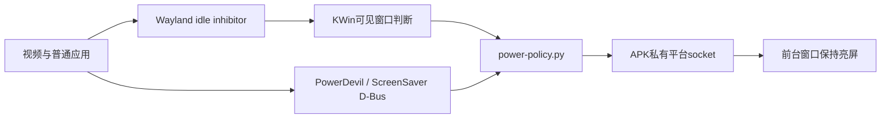

# Plasma Mobile 运行修复与验收

2026-09-23。本篇记录桌面已经显示后，继续追到实际应用、硬件后端和重启恢复的工作。总架构与能力矩阵见 [40篇](40-plasma-mobile-integration.md)，输入法见 [41篇](41-plasma-rime-input.md)。本轮没有修改Phosh的APK/rootfs。

## 先调研，再选择实现

| 问题 | 查阅的实际实现 | 本机选择与理由 |
|---|---|---|
| Maliit输入时重启、拼音候选靠前 | Maliit2.3.1/master、Fcitx5 Wayland/Rime/OSK、Qt公开输入法API、Plasma Keyboard6.6.6、librime1.16.1 | 使用Plasma Keyboard前端和Rime后端，保留发行版Qt与候选UI；不引入root evdev键盘服务 |
| 切语言后旋转报错 | Plasma Keyboard6.6.6与master LanguagePopup.qml | 菜单位置使用打开时坐标，避免Qt.binding持有已经销毁的旧按键 |
| 手机模式设置启动崩溃 | plasma-settings25.12.0，ASLR开启的GDB栈，上游ModulesModel修复 | 回移已存在的上游提交，不通过禁用ASLR隐藏问题 |
| 音频空闲后恢复卡住 | Termux PulseAudio17.0-4 AAudio/SLES模块、Android音频线程约束、Termux依赖修复 | Plasma专用实例改用官方OpenSL ES sink，保留3秒空闲挂起；不靠始终播放静音绕过 |
| 权限弹窗在手机上越界 | xdg-desktop-portal-kde6.6.6和master PortalDialog.qml | 限制移动端Control宽度，不修改所有应用缩放 |
| 私有portal程序无法截屏 | KWin6.6.6 wayland_server.cpp允许列表、portal desktop元数据、Qt6.10.2 QDesktopUnixServices | 元数据Exec指向真正的私有二进制，保留restricted Wayland接口允许列表；不全局关闭权限检查 |
| 看视频保持亮屏、锁屏 | PowerDevil6.6.6 PolicyAgent、GTK4.22 Wayland/portal抑制路径、KWin IdleInhibition、Android窗口屏幕策略 | 复用标准D-Bus及Wayland请求，映射为前台APK的有限租约；物理锁屏交给Android |
| Wi-Fi/休眠设置无效 | Plasma Settings模块加载入口、现有NetworkManager桥、Android Settings API | 实体Wi-Fi/蓝牙入口转Android；电源页进入设备面板，避免写无效的Linux休眠参数 |

主要源码来源：[Settings上游修复64044187](https://invent.kde.org/plasma-mobile/plasma-settings/-/commit/64044187b34c8007be456e247e4d32cb883140fd)、[Plasma Keyboard6.6.6](https://invent.kde.org/plasma/plasma-keyboard/-/tree/v6.6.6)、[Portal6.6.6](https://invent.kde.org/plasma/xdg-desktop-portal-kde/-/tree/v6.6.6)、[KWin6.6.6](https://invent.kde.org/plasma/kwin/-/tree/v6.6.6)、[PowerDevil6.6.6](https://invent.kde.org/plasma/powerdevil/-/tree/v6.6.6)、[Qt6.10.2平台服务](https://github.com/qt/qtbase/blob/v6.10.2/src/gui/platform/unix/qdesktopunixservices.cpp)、[Termux PulseAudio构建](https://github.com/termux/termux-packages/tree/master/packages/pulseaudio)、[Android屏幕常亮规则](https://developer.android.com/develop/background-work/background-tasks/awake/screen-on)。本轮查阅的固定源码/补丁副本保存在 `.work/refs/plasma-mobile-20260923/upstream/input/`。

## 修复落点与许可

- `settings-model.patch`：回移上游修复。旧childrenList边遍历边修改QList，且data检查使用了错误的根行数；手机分类排序会触发未定义行为。Settings采用GPL-2.0-or-later。
- `settings-hardware.patch`：仅检测到Android私有socket时启用。Wi-Fi/连接/移动网络模块启动Android互联网面板；蓝牙模块转Android蓝牙页；电源模块打开设备面板。其他桌面模块仍由KDE提供。实测Wi-Fi显示真实已连接网络；设备面板展示电量和Android显示设置入口。
- `keyboard-popup.patch`：语言菜单旧对象生命周期修复；前端程序 `/usr/local/libexec/moto-plasma-keyboard`。Rime适配代码GPL-3.0-or-later，librime包及词库按发行版各自版权保留，详见41篇。
- `portal-mobile-width.patch`：私有 `/usr/local/libexec/xdg-desktop-portal-kde`。源码6.6.6的PROJECT_DEP_VERSION调到Ubuntu实际KWayland6.6.4后编译通过，没有替换发行版KWayland库。
- `portal-override.conf`：仅portal后端设置 `QT_NO_XDG_DESKTOP_PORTAL=1`，避免Qt程序注册自身时再次激活等待中的portal；其他应用照常用portal。
- `/usr/local/share/applications/org.freedesktop.impl.portal.desktop.kde.desktop`：Exec改为私有二进制，保留 `X-KDE-Wayland-Interfaces`。只安装二进制而不改此元数据，会导致CreateSession失败。
- `android-audio.pa`：Termux官方 `module-sles-sink`，LGPL-2.1-or-later。原AAudio路径的同步等待/关闭有卡住风险；未取得完整宿主调用栈，不将这一推断写成已经证实的唯一根因。实际换后重复恢复测试已通过。
- `power-policy.py` / `brightness.py` / APK `PlatformBridge.java`：标准PowerDevil、legacy Inhibit和ScreenSaver适配。自有Python代码GPL-3.0-or-later。
- `kwin-idle.patch`：在显式Android渲染路径转发KWin可见窗口的Wayland idle inhibitor，5秒重报以支持桥重启。KWin仍遵守上游窗口可见性判断；按KWin GPL-2.0-or-later保留源码补丁。

三个KDE私有应用由 `plasma/build-desktop-fixes.sh` 构建。需配套KDE/Qt开发包，Kirigami Addons包名为 `kirigami-addons-dev`。该脚本安装二进制和portal允许列表元数据；服务drop-in、中文portal core的`.mo`与用户会话配置需按本机已存配置部署，不能只运行此构建脚本就声称完成新机安装。

KWin构建要注意：`dpkg-buildpackage -nc` 可能因为 `debian/debhelper-build-stamp` **完全跳过源码编译**。本轮曾出现+moto2包版本已变而库仍为旧内容，随后强制 `cmake --build`、重新打包安装，并用库内 `SetWaylandInhibition` 符号及运行行为核对。最终成功日志为 `kwin-idle-rebuild.log` / `kwin-idle-install.log`；较早的 `kwin-moto2-build.log` 不能当最终编译证据。新增 `plasma/build-kwin.sh` 从干净Ubuntu源码完整构建；两个补丁已验证可以应用到6.6.6上游源码。

## 电源行为

- 每个D-Bus租约记录调用者唯一名；其他客户端不能释放；退出断连时回收。请求最多512条，APK续约12秒过期。
- 实际Showtime播放时，RequestedInhibitions有“播放视频”，Android `keepAwake=true`；暂停后租约为空。证据 `power-showtime-final.log`。这验证实际播放器联动，日志中的该次请求走D-Bus，不能冒充专门覆盖了所有Wayland-only播放器。
- Wayland转发补丁已编译安装；随后独立GTK ApplicationWindow直接请求idle抑制，实测KWin租约出现、uninhibit后回收（16:00:01/04，`WAYLAND_IDLE True True` / `False False`）。初次直接调用Gdk私有方法的探针失败已改用公开Gtk.Application接口。仍不据此承诺所有第三方播放器都正确发出请求。
- Android窗口离开前台后不继续强制亮屏；不创建CPU wakelock。不承诺息屏听歌、后台视频/相机持续运行，Android仍可冻结后台APK。
- ScreenSaver.Lock转发Android睡眠键；异步延迟300ms执行，让IPC先返回，避免屏幕关闭后APK冻结造成假超时。实测D-Bus调用返回成功、设备进入Dozing，再唤醒可回桌面。
- 没有创建Linux解锁密码；KWin使用`--no-lockscreen`，自动/恢复锁屏关闭。

## 实际验收记录

| 项目 | 结果及证据 |
|---|---|
| 中文引擎 | 独立目录300次组合/选词通过；真实连续触屏输入、4次收起重开、中英文切换、日常Firefox地址栏通过，详见41篇 |
| 重启后中文 | 15:52整机启动完成，点APK按需启动LXC；15:53真实触屏`nihao`首候选“你好”，默认简体中文；`rime-after-reboot-nihao.png` |
| 音频恢复 | 新后端10轮实际GStreamer播放+5秒空闲均EOS；`audio-resume-final.log`最后`passed:true`；之前同一宿主daemon PID未变，Showtime3轮暂停恢复位置递增 |
| 照片 / 录像 | Snapshot51前后照片写Shared/Pictures/Camera；录像21.356秒，H.264720×1280约635帧，MP3单声道44.1kHz；全片硬件解码退出0；文件在手机共享目录 |
| 浏览器播放 | H.264含B帧720p约10秒，318帧/6丢帧；VP9约4秒，139帧/1丢帧；当时有双核编译负载，不用作空闲性能基准 |
| 浏览器硬编 / RTC | WebCodecs H.264 60帧编码解码无错；本地WebRTC回环有实际Android编码/解码计数；`browser/browser-webcodecs.json`、`browser/browser-webrtc.json` |
| 浏览器采集 | 前后摄720×1280、麦克风非零；WebM VP8+Opus录制3秒；Firefox移动UA实际JS读取通过；下载写共享Downloads |
| 文件portal | OpenFile实际选择共享Downloads测试文件，Response=0返回file URI；`file-portal.png` |
| 屏幕portal | 用户界面选WL-0，ScreenCast三阶段Response=0，PipeWire收到20帧；`session-pre-reboot.log`中15:43:50 `SCREENCAST_FRAMES_20 True`；测试管线必须约束video/x-raw，未约束时WirePlumber无法判断media.type导致假失败 |
| 剪贴板 / 旋转 | 双向文本通过，原剪贴板保留恢复；横屏→竖屏、键盘菜单与触摸通过 |
| 普通应用 | 重启后Dolphin、Koko、QmlKonsole、Elisa、Haruna逐个实际显示，截图`app-*.png`；这只是启动验收，不代表其全部功能已测 |
| 设置入口 | 崩溃修复后实际手机环境启动；Wi-Fi入口打开Android真实网络面板，`settings-android-route.png`；设备面板真实SSID展示，`plasma-return.png` |
| 双桌面 / 后台返回 | Phosh原环境显示正常，返回Plasma继续显示；`phosh-preserved.png`、`plasma-return.png` |
| 整机重启 | Android `sys.boot_completed=1`、root正常、SELinux Enforcing；点Plasma APK自动启动，桌面显示，用户服务0 failed；`after-reboot.png`、`session-after-reboot.log` |

测试数据不会替代长期稳定性验证。相机首次拍照延迟、后台冻结后的媒体恢复、PC界面最小尺寸等仍需按实际使用继续改善；本轮没有把“应用进程存在”当成视频可播放或硬件已接通。

## 窗口最小尺寸大于最大尺寸时不再断开应用（KWin moto16，2026-09-25）

- **现象**：微信4.1（Linux ARM64版，4.1.13.23）登录后立即退出。系统日志：`xdg_toplevel#34: error 2: minimum width can't be bigger than the maximum width`，KWin随即报`error in client communication`。
- **原因**：
  - 微信把Qt 6静态编译进程序，不支持`kde_primary_output_v1`，也不支持分数缩放。它的Qt把KWin最先通告的`wl_output`（手机WL-0，逻辑360×800）当作主屏幕，程序中有`primaryScreen`调用。
  - Wayland客户端在窗口映射、收到`wl_surface.enter`之前，无法知道窗口会在哪块屏幕上。
  - 推断：登录后新建主窗口时，最大尺寸取自主屏幕（手机），而最小宽度大于360。
  - 登录窗口本身是固定的280×380，没有问题（WAYLAND_DEBUG记录）。主窗口的具体数值还需要一次登录来抓取。
  - KWin在提交时检查尺寸并发出协议错误`invalid_size`（`XdgToplevelInterfacePrivate::apply`，符合xdg-shell规定），连接因此断开。
- **考虑过的方案**：
  - 投屏时把电视通告为第一个输出：会影响所有同类客户端，还要重新创建手机的`wl_output`，已打开的窗口会重排。未采用。
  - 让微信经XWayland运行，并把X11主屏设为电视：会话目前未启用XWayland。未采用。
  - 采用：KWin遇到“最小值大于最大值”时，记录警告并丢弃冲突维度上的最大值（设为0，即不限），不再断开客户端。最小值代表内容的需要，错误的最大值来自客户端误判的屏幕。这不符合协议“必须报错”的要求，是本机为兼容这类客户端做的放宽。
- **验收**：`.work/diag/minmax-probe.c`（wayland-client + xdg-shell）提交最小700×400、最大360×800，并附上缓冲区。moto16下它在2秒后仍保持连接，KWin日志记录`xdg_toplevel minimum size QSize(700, 400) exceeds maximum size QSize(360, 800) … ignoring the maximum width`。微信登录后的实测待用户登录一次后补充。

## 本地保存与恢复边界

`.work/refs/plasma-mobile-20260923/release/` 保存最终定制Mesa/KWin deb、私有运行文件、版本/hold清单和适配源码；SHA256SUMS用于本地完整性检查。APK为上级目录的 `Plasma-Mobile-1.4.apk`。全部是本机恢复材料，**不是已经验证的空白设备一键安装包，也不是Fastboot ROM**。

- 定制Mesa七包和KWin五包整体hold。恢复先按同一Ubuntu依赖闭包装包，再部署私有运行文件与服务配置，避免覆盖发行版Qt或GLVND。
- APK需沿用本机签名更新；签名私钥不收入归档。重装到其他应用UID时音频cookie、Android SHM MCS标签必须重新生成。
- `/usr/local`归档不含用户profile、Rime学习词频、共享照片视频或音频cookie。额外路径清单用于恢复GStreamer插件、Firefox私有libavcodec链接与服务配置。
- 此归档不会自动迁移Android应用授权、LXC内核/Magisk模块、Termux音频环境或独立Phosh。底层已有环境仍是部署前提。

常用启动/停止命令、数据位置、构建入口和标准接口关系见40篇；后续适配仍按AGENTS.md要求先查固定上游源码，再保存选择理由、补丁、版本、许可及端到端证据。

2026-09-23后续：顶部面板视觉高度与应用工作区不一致的问题已修复，动态高度、全屏、自动隐藏及旋转/桌面重启验收见[43-plasma-panel-workarea.md](43-plasma-panel-workarea.md)。
