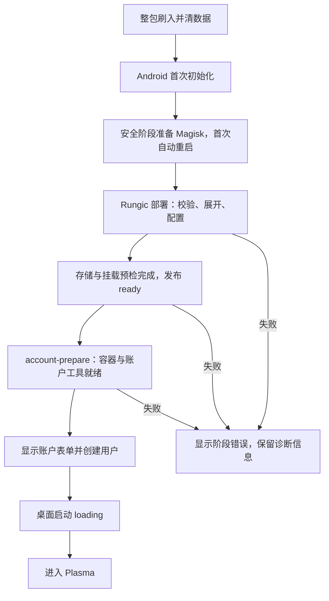

# G100 完整镜像实施复盘：遇到的问题与最佳解决路径

> 2026-09-30 方向更新：本文保留旧整包清数据安装的过程与实机证据。当前三段式改为设备底座准备、独立 RungicOS 镜像、Rungic 单独安装/升级，见 [75 篇](75-image-build-separation.md#2026-09-30rungic-独立安装的三段式目标)。以下整包流程不再是日常发布的默认目标，也不能替代独立安装验收。

日期：2026-09-28。范围：G100 / XT2533-4 / `portov_cn`，原厂固件 `W1VT36H.1-51-8`。

## 本轮结论

最终候选 `portov-20260928.5` 已完成整包刷写和清数据，用户随后确认：**重新安装后正常进入 Plasma 界面，效果良好。**

这轮最重要的收获是明确了交付标准：从干净设备刷入发行包开始，系统自行完成 Android/Magisk 初始化、Rungic 部署和容器准备，再让用户配置账户、进入桌面。每个阶段都必须有真实的就绪条件和可见的等待状态。

本文总结可复用的方法。逐次试验、修订、哈希与实机日志索引见 [79 篇执行记录](79-g100-ci-execution.md)。早期版本中的“待验证”是当时状态，最终结果以本文及 79 篇末尾为准。

后续执行已固化为项目 Skill：[rungic-three-stage-image](../.agents/skills/rungic-three-stage-image/SKILL.md)。它提供通用三段流程、新机型接入和工具适用边界；当前调用示例：`使用 $rungic-three-stage-image 为目标机型构建独立 RungicOS 镜像，并核验独立安装前提与待办`。

## 一、我们遇到了哪些问题？

### 1. 自编译 GKI 能编过，却可能破坏原厂模块兼容性

直接开启 IPC、namespace 和额外 cgroup 配置后，原厂模块对照出现 **9,768 个 CRC 不匹配**。内核分支名称相同，并不能保证结构体布局、符号版本和模块签名信任相容；Android 16 设备也不能仅凭 Android 版本去选择内核分支。

本轮锁定与原厂匹配的 ACK 提交、构建编号、4 KiB 页和模块信任证书，删除不必要的配置增量，通过 Android KABI 预留槽承载新增字段。最终 363 个模块的 20,741 个符号引用中，可与 GKI 导出比对的 19,009 个引用为 **0 CRC 不匹配**；其余 1,732 个 OEM 模块间引用不在这项检查的证明范围内。随后以临时启动验证 Android、模块与 LXC/桌面。

**经验：**每个机型/固件 spec 都要锁定内核配方和兼容证据。静态 ABI 检查与实机启动共同放行，不能将“编译成功”当作内核可用。

### 2. 开发机上能运行的用户空间，放进干净镜像后仍会缺依赖

- x86 主机用 PRoot 制作 ARM64 rootfs 时，systemd 安装脚本的原子改名触发 `EXDEV`。改用独立 user/mount namespace 中的真实 chroot，配合 QEMU 执行 ARM64 程序。
- 开发环境中的 Python venv 使用 `--system-site-packages`，掩盖了软件包未声明的运行依赖。补齐 Debian `Depends` 后，在干净 rootfs 内核验 `dpkg --audit` 和 `pip check`。
- 发行版包名变化、Firefox snap 过渡包等问题，需要由固定包版本、软件源优先级和完整依赖检查发现。
- Android toybox 虽在帮助中列出 `dd conv=sparse`，实机却拒绝该参数；改用已验证的 ARM64 稀疏写入器，并校验展开后整镜像摘要。

**经验：**镜像构建应从干净环境和明确依赖开始，所有手工补装都必须回收到配方。工具的实际行为也要验证，不能只信帮助文本。

### 3. 多个 ADB 和刷写模式差异，让设备状态容易被误判

本轮曾同时存在 5037/5038 两个 ADB server：一个连接 USB G100，另一个只看到 Wi-Fi G100 S。单看某个端口设备为空，不能推断手机启动失败。

Motorola 的 bootloader 版本还按多行返回，与 Android 属性存在已记录的表示差异。刷写器需要分别保存、严格核对这些值，不能为了通过检查而泛化为忽略版本。

直接在 bootloader 刷原厂 super 分片时，第二片传输失联。恢复连接后验证的路径为 **bootloader → fastbootd → bootloader**，由工具自动转换、完成不同分区的写入。本轮 fastbootd 转换约需一分钟。

**经验：**设备身份、端口、序列号、槽位、固件和镜像摘要是每次操作的前置条件。完整一键包可以在多个设备模式间自动切换；是否需要 fastbootd 应由各机型实际验证的分区策略决定。

### 4. 刷写成功后反复进入 Recovery，核心差异在“干净首启”

早期整包刷写退出码为 0，但清数据后出现 `Cannot load Android system`；恢复出厂设置也没有直接解决。简单 Magisk 镜像能启动，同一个定制 init_boot 在数据已初始化后也能启动。这表明故障与干净首启条件相关。

最初将 Rungic 部署改为 Magisk `service.d` 触发，整包复刷仍然失败，说明仅更换部署触发器不够。核对 Magisk 31.0 源码后发现：早期 `/data/adb` 不存在时，上游主动退出相关初始化，到 `boot-complete` 才创建目录。我们此前的离线初始化没有充分遵守这个时序。

最终方案：

1. 早期缺少 `/data/adb` 时，只在 ramdisk tmpfs 记录延迟标志，不写 `/data`。
2. Android 完成启动后，准备离线 Magisk 运行文件和后续入口，自动重启一次。
3. 下一次启动进入正常 Magisk 生命周期；再由 `service.d` 等 Android 就绪后部署 Rungic。

`.3` 已取得完整清数据首启成功的设备日志；`.5` 将后续账户准备和 loading 修复一并纳入，用户确认重新安装后正常进入 Plasma。

**根因边界：**没有取得早期失败的具体调用日志，因此不能宣称已经定位某个加密函数或证明用户数据确实损坏。已确认的是旧方案存在初始化时序问题，以及遵守上游生命周期的新路径通过了清数据安装。

### 5. APK 预装与普通安装不是相同的打包路径

Rungic APK 被复制到 `product/app` 后，缺少配套 ARM64 JNI 库，启动报 `libc++_shared.so not found`。普通 `pm install -r` 能临时修复，因为安装过程处理了原生库，但只读 product 镜像仍然有缺陷。

组包工具现统一提取压缩的 ARM64 `.so` 到对应应用的 `lib/arm64`，同时保留所需权限与标签。Magisk 使用完整官方 APK 离线种子，按其机制安装为普通应用。

**经验：**检查 APK 路径和权限还不够，必须实际启动；临时安装成功后，要修复组包过程并重新验证只读镜像。

### 6. 用户名密码反复提交失败，实际是账户创建前的环境没准备好

第一次明确的错误是音频 socket 目录不存在：账户创建会先启动容器，但音频目录只在普通桌面启动路径中准备。失败发生在调用账户助手之前，与密码内容无关。

修复放在公共 `start_container()`：统一准备音频目录，供账户配置与桌面启动共同使用。后续出现的 `bind shared ... no such file` 指向 Android 共享存储绑定；检查时目录已存在、重试成功，缺少首次失败现场，因此具体竞争时序仍未直接证实。

最终补齐了整条前置条件：等待 Android 存储真正可用，幂等创建共享目录，完成挂载预检，再提前启动容器、检查账户工具和 systemd 状态。

**经验：**用户界面的“可以填写账户”，应代表系统已经具备创建账户的条件。底层初始化失败必须显示为安装/准备失败，不能让用户靠重复输入密码碰运气。

### 7. 首次安装缺少 loading，后台工作与用户操作发生竞争

只检查 Android `sys.boot_completed=1`，不能证明 rootfs 已展开、共享目录已挂载或容器已准备好。普通重启、已有账户启动和手工补脚本，也无法覆盖完整镜像的首次进入流程。

`.5` 增加实际阶段状态：校验、运行环境、展开镜像、配置、存储和收尾。应用读取与本次 release 匹配的原子状态文件；缺失、旧版本、截断或错误状态均不放行。全部准备完成后再调用 `account-prepare`，成功才显示账户表单。创建后继续显示桌面启动 loading。

未知耗时采用不定进度动画与真实阶段文字；等待条件有超时/失败处理。root 控制器另外校验完成标记，界面上的 ready 不能替代底层校验。

**经验：**给用户充足的等待时间，要靠可恢复、可解释的准备流程实现。固定延时无法保证不同手机上依赖都已就绪。

### 8. fastbootd 手机屏幕没有进度，电脑端又曾缓冲日志

原刷写工具使用 `capture_output=True`，大分区写入期间用户看不到持续输出。已改为实时转发 fastboot 输出，显示阶段、分片编号和无输出期间的等待说明，并保留超时中止。

手机端仍是原厂 fastbootd 界面，**本轮没有实现手机屏幕上的刷写日志/进度**。已有源码研究表明可以考虑接入 RecoveryUI，但还需要验证 Motorola 恢复环境，并连接真实传输与写入事件；fastboot 的 USB INFO 输出不会自动显示到手机屏幕。

**经验：**先保证电脑端持续、诚实地解释状态；手机端进度作为独立适配项，不能把主机输出改进写成手机界面已完成。

### 9. 实施过程也需要纠正

- 一度过早把相关性归结为某个触发器故障，后续复刷推翻了该判断。应保留失败现场，控制变量，并明确写出证据边界。
- 多次局部修复能够在当前设备生效，但尚未进入发行镜像。每项修复都必须追踪到源码、种子、product 和最终发行摘要。
- 用户已将重点限定为首启/账户/桌面后，不应继续扩大硬件验收范围。本轮摄像头按要求跳过，既有报告保留，不能写成通过。
- G100 S 的历史经验有用，但旧机型的不同实验不能拼成当前整包的验收结论。操作前查知识库的要求已写进 `AGENTS.md`。

## 二、最佳解决路径是什么？

### 1. 通用框架下维护机型 spec，保留三个独立构建阶段

| 阶段 | 职责与交付物 | 必须通过的门槛 |
| --- | --- | --- |
| CI1：内核 | 根据 spec 固定上游、补丁、配置与工具链，生成 GKI/boot 和兼容报告 | 模块 ABI、签名信任、页大小、Android 与容器所需能力 |
| CI2：RungicOS | 固定 ARM64 包及补丁，生成 rootfs、包锁和摘要 | 干净依赖安装、文件系统、目录/权限、运行依赖完整性 |
| CI3：手机发行包 | 消费前两者与精确 OEM 输入，纯净化、预装、组包、刷写和验收 | 输入交叉核对、分区容量/元数据、完整清数据首启、账户与桌面 |

内核交叉构建、rootfs 组装和最终镜像制作由当前工作站承担；定制 ARM64 软件包继续利用 Mac mini 原生构建。实际已走通本地工具链，完整无人值守 CI 调度、不可变包仓库快照等仍须按 [77 篇](77-g100-three-ci-assessment.md) 继续收敛，不能统称全部平台化完成。

spec 描述机型/固件、内核配方、原厂输入摘要、分区与刷写策略、纯净化策略和验收要求。连接端口、测试序列号属于运行实例。新机型复用流程，通过新的 spec 和必要适配扩展，避免复制整套脚本。

所谓“能力报告”，应是这些门槛对应的可核验结果：明确对象、版本、检查方法、通过范围和缺口。它既包含自编译内核，也包含 Android 宿主和容器的运行条件，不能只是配置项列表。

### 2. 固定输入，确保修复确实进入交付物

每次发布绑定源码提交、解析后的 spec、OEM 摘要、内核产物、软件包版本、rootfs、APK/宿主种子和首启协议版本。组包仅消费校验过的指定产物，拒绝从工作目录随手取“最新文件”。

完整一键包包含所需分区载荷、安装器、manifest、哈希清单和恢复说明。Rungic rootfs 以只读 product 内的种子交付，设备首次启动后展开到 `/data`，避免复制某台手机已加密的用户数据。个人账户、凭据和家目录备份不进入发行包。

纯净化也进入 spec：本轮移除 15 个明确第三方预装包及渠道配置；三个 AI 助手通过 SKU 策略排除当前用户安装，APK 本体仍保留。保留核心 Android 服务和未确认可替代的输入法，区分“删除 APK”和“默认不安装到用户”。

### 3. 将首次进入设计成受控状态流程

用户在准备期间打开入口，应看到当前阶段；关闭再打开可继续读取状态。账户表单只在前置条件全部满足后显示。服务端保持幂等准备和独立门槛，防止旧状态、快速重复操作或其他入口绕过检查。

这是后续所有机型都应共用的首启契约。具体设备可以有不同准备步骤，但对界面提供一致的状态和错误语义。尚未进行的断电场景测试不能默认为通过。

### 4. 排障与最终验收分开执行

**排障时：**先查知识库与固定版本源码；采集失败现场；固定其余分区和数据条件，逐项替换启动组件，减少整包重刷造成的变量变化。将临时修正回收到公共入口和构建配方。

**最终验收时：**从发行包自身启动刷写，执行约定的清数据安装，不依赖旧账户或手工补文件。记录刷写、首启部署、账户配置和 Plasma 实际显示，并绑定同一个 release。部署状态、UI 受控测试、设备探针和用户确认各自注明来源。

本轮最终反馈证明重新安装后正常进入 Plasma；`.3` 的详细设备检查属于 `.3`，不能直接改标签作为 `.5` 的完整探针报告。后续自动化应围绕这条用户流程收集证据，避免用大量外围测试稀释交付重点。

### 5. 部署通过后及时清理，保留可恢复和可审计的产物

发行包及恢复材料持久保存并校验、验收记录归档后，立即按本次 run-id 清理临时源码、内核输出、rootfs 暂存、解包分区和相关构建缓存，同时核对释放空间。Mac mini 与本机分别执行归属检查，不能全局清空 Docker/Podman 或删除其他机型缓存。

保留正式包、原厂恢复输入、固定软件包及来源记录、摘要和验收报告。本文编写时尚未完成本轮独立发行归档与缓存清理，因此不将这两项记为已完成。

## 当前结果与交付边界

| 项目 | 当前证据与状态 |
| --- | --- |
| 最终设备镜像 | `portov-20260928.5`；02:22 开始整包刷入，02:31 刷写退出 0，包含 userdata/metadata 擦除 |
| 首次进入 | 用户确认重新安装后正常进入 Plasma；最终反馈未另行逐项说明账户步骤，不虚构新的账户探针结果 |
| loading 与账户准备 | 已纳入 `.5`；此前完成受控状态及公共入口检查 |
| 完整目录 | `.work/ci/runs/portov-20260927-86c6642d/release/portov-20260928.5/`；独立分发归档仍待完成 |
| 电脑端刷写日志 | 已改为流式输出并通过隔离测试；此工具修订晚于 `.5` 实际刷写，设备载荷未变 |
| 手机端刷写进度 | 原厂 fastbootd 仍无本项目进度实现 |
| 其他功能 | 依用户要求不再扩大验收；摄像头跳过 |
| 通用范围 | 框架面向多机型；当前包绑定这台 G100，未证明适用于其他手机或其他宿主平台 |

后续执行入口：[通用设计](75-image-build-separation.md)、[三段 CI 分工与清理规则](77-g100-three-ci-assessment.md)、[G100 固件清单](78-g100-firmware-inventory.md)、[本轮实施证据](79-g100-ci-execution.md)、[共享后端与接口契约](research/31-backend-integration.md)。

## 2026-09-28 补充：按用户要求清理过时 product

已删除本 run 的 `product/assembled-v3` 至 `assembled-v8` 和原始 `product/root`；clean 镜像/verified-root、发行包及恢复输入保留。报告和元数据改存 `.work/audits/product-cleanup-20260928/build-metadata/portov-20260927-86c6642d/product/`。原 v8 被 X70 复用的三个载荷已校验并迁往 `.work/deps/product-seed-20260928/`；本轮仅完成明确范围的 product 清理，不追认 rootfs/内核清理或独立分发归档完成。跨机清理范围和实际空间收益见 83 篇末及 audit JSON。

## 2026-09-30：旧完整包清理

用户要求改走 Rungic 独立安装并删除旧完整刷机包。已删除 G100/X70 共 8 份完整包，文件系统实际可用空间增加约 **114.38 GiB**（约 87 GiB → 201 GiB）。包内 manifest、报告、安装脚本已归档到 `.work/audits/full-bundle-cleanup-20260930/metadata/`；最终 G100 `.5` 和 X70 `.3` 的 boot/init_boot/vbmeta 小型恢复镜像一并保留。原厂输入、独立 rootfs、宿主种子、运行依赖和实机日志未删除。历史报告中的整包路径现在仅用于溯源，不能再直接执行；删除清单见 [来源记录](../provenance/full-bundle-cleanup-20260930.json)。
