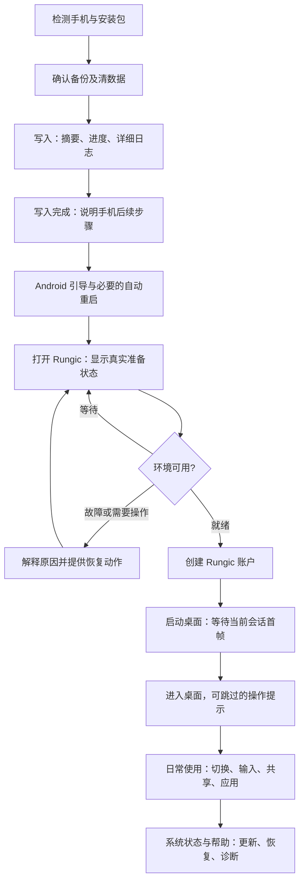

# Rungic 用户全流程 UX 审查与改进方案

2026-09-28；源码基线 `37c109d7`。覆盖拿到安装包、刷入、首启、账户、桌面、日常操作和恢复。本文为源码与已有实施记录的体验审查，未唤醒/操作手机、未重新刷写，也未做新一轮硬件验收。代码可确认的行为、体验风险和改进建议分别说明。

## 结论

完整清数据安装已经取得用户确认，真实 loading 和账户准备门槛也已存在。下一轮重点是让用户始终知道：**现在发生什么、是否需要操作、出错后如何继续、操作会不会影响文件。**

优先完成三件事：

1. 将刷机、系统准备、账户配置和桌面显示串成连续、可信的状态体验。
2. 每种失败提供明确且适用的恢复动作，避免一直转圈、裸错误或通用“重启”。
3. 统一 Rungic 的名称、账户说明与日常导航，降低 Android/Linux 两套环境的理解成本。

## 一、用户旅程与当前断点

| 阶段 | 用户想完成什么 | 已有基础 | 可以改善的地方 |
| --- | --- | --- | --- |
| 选择安装包 | 确认自己的手机能用 | spec、固件与序列号绑定、哈希校验 | 面向用户展示机型/SKU/固件/电脑要求；别让用户从文件名猜兼容性 |
| 准备安装 | 接线、备份、开始 | 单一刷写入口、明确擦除确认 | 先检测目标，再展示“将清除哪台手机哪些数据”的摘要与确认；确认后才写入 |
| 刷写中 | 知道仍在工作 | 八阶段、实时 fastboot 输出、等待提示 | 摘要与详细日志分层；校验大文件也应有进度；模式切换前解释手机会出现什么 |
| 刷写结束 | 明白下一步去哪里 | 终端说明重启、Android 引导和 Rungic 入口 | 将“写入完成”和“安装可用”分开；保留后续步骤，注明何时可拔线 |
| Android 首启 | 完成必要设置 | 沿用原厂引导 | 提前说明一次自动重启；完成 Android 引导后清楚指向 Rungic，避免找入口 |
| Rungic 初始化 | 安心等待，不误操作 | 原子状态、真实阶段、不定进度 | 缺失状态可能永久等待；失败统一提示重启；缺少进度新鲜度、帮助和分类型恢复 |
| 创建账户 | 一次填完并成功 | 用户名/密码校验、防重复提交、密码不落日志 | 说明与手机 PIN 的区别；环境错误不归咎密码；补可见密码、标签及明确退出语义 |
| 首次桌面 | 看到可操作画面 | 控制器等待会话和进程 | 遮罩隐藏还没有明确绑定“桌面首帧已呈现”；首次操作缺少轻量指引 |
| 日常使用 | 输入、切换、装软件、管理文件 | 标准 KDE 应用、输入法、Discover、共享存储 | 返回手势难发现；切换与停止含义不同；两套密码、文件位置和权限要有一致说明 |
| 助理/投屏 | 可选地使用扩展能力 | 独立助理屏、全屏/电视控制 | 手势和图标隐藏，模式含义不直观；连接动作需要可见结果与可退出状态 |
| 锁屏与返回 | 安全锁定，再回到工作 | Android 管理锁屏，宿主恢复路径 | 明确手机锁屏与 Linux 管理密码的边界；不要用“息屏”检查代替真正锁定验收 |
| 更新与恢复 | 保留文件并可靠升级 | 包发布、快照/回滚工具 | 现有工程入口需要产品化；告诉用户恢复范围，不能笼统承诺所有数据都恢复 |

## 二、优先级最高的源码发现

P0 表示下一轮完整安装 UX 应先完成；P1 为日常使用重点；P2 为随后增强。这里是改进优先级，不代表每项已在实机复现。

### UX-01 / P0：等待状态无法证明后台仍在推进

**源码事实：**`FirstBootState.read()` 遇到状态缺失、旧 release、读取失败等，统一返回准备中；MainActivity 每秒继续读取。首启状态只有 release/state/phase，没有更新时间或心跳。首启脚本等待 `/storage/emulated/0/Android` 的循环没有期限。

**体验风险：**加载动画可能表示正常耗时、等待解锁，也可能表示服务根本未启动；用户无法区分。

**改进：**保留现有真实阶段，增加兼容版本化的更新时间/活动信号，以及 `等待用户操作 / 正在处理 / 状态过久未更新 / 失败` 分类。时间门槛用于触发检查和帮助，不直接断言失败。若解压较久，心跳或字节进度应来自实际工作进程；单独的计时器不能伪装成工作进度。

**放行证据：**缺失状态、旧状态、等待解锁和缓慢展开均有不同说明；没有后台进展时提供“检查状态”和帮助入口；不通过提前进入表单来绕过等待。

### UX-02 / P0：所有安装失败都建议重启，缺少可执行的恢复路径

**源码事实：**FirstBootState 的 failed 状态统一提示“请重启手机以继续安装”；此时隐藏 spinner、停止轮询且文字不可点击。普通启动异常则直接附 `e.getMessage()` 并以“点此重试”的文字触发重试。

**体验风险：**校验失败、空间不足、等待解锁和挂载失败需要不同处理。永久性错误不会被重启解决；原始路径/命令报错不够可理解。安装失败页与启动失败页的交互也不一致。

**改进：**后端输出稳定错误分类和可用动作；页面先显示“发生什么 → 对文件有何影响（能确认时）→ 下一步”，技术详情折叠。按钮明确为“重新检查”“继续准备”“打开设置”“导出诊断”等，只有已验证适用时才提供重启。导出先脱敏并让用户主动分享。

**放行证据：**分别注入空间不足、载荷校验失败和存储未就绪；每种错误有不同动作。失败后重开入口仍能看到原因。重试前核验原任务是否仍在运行，避免并行提交或反复重启。

### UX-03 / P0：桌面进程存在还不足以移除 loading

**源码事实：**`plasma/rungic-plasma` 以会话 env 文件和 KWin/plasmashell PID 判断启动 ready；MainActivity 收到控制命令成功后立即隐藏 loading。当前这段路径没有显式等待桌面首帧呈现。

**体验风险（待实机验证）：**进程已起来但画面还没提交时，可能短暂显示空白或旧画面。不能据此宣称当前设备已发生黑屏。

**改进：**把“运行环境就绪”和“当前桌面首帧已呈现”分开。宿主复用原生显示回调，在新会话/当前 surface 的桌面帧真正呈现后移除遮罩；旧会话或其他输出的帧不能满足条件。若慢，显示“桌面正在启动”；超时提供会话级恢复。

**放行证据：**冷启动和 surface 重建不提前露出空白；首帧到达后遮罩消失；呈现超时可恢复，不能用固定 sleep 替代信号。

### UX-04 / P0：账户创建还暴露了过多系统概念和失败负担

**源码事实：**表单默认用户名 `linux`，标题为“设置 Plasma Mobile 账户”；说明称“现有应用和文件会保留”。只有 hint，无独立固定标签；无显示密码开关；提交时清空密码，失败后直接显示异常并重新启用输入。“稍后”会关闭 Activity。

**改进：**

- 标题使用“创建 Rungic 账户”；说明“此密码用于安装软件和更改系统设置，与手机解锁密码不同”。保留用户名/密码规则，并区分首次创建与修改账户文案。
- 增加固定标签、显示密码、键盘下一项/完成动作。用户名示例与后端规则一致；密码限制超出时给对应原因。
- “稍后”改为“返回 Android，稍后继续”，并说明下次打开会回到配置步骤。
- 账户输入错误贴近字段；环境错误进入恢复页。保留非敏感用户名，不把密码写进持久状态。若超时，不直接要求再次创建：先查询账户事务结果，识别实际已完成的情况。
- 已配置账户再次打开不得出现创建表单；不可把“密码重置”混为初始化重做。

**放行证据：**新用户知道何时使用此密码；创建仅需一次成功提交；环境失败的恢复不要求反复试密码；后台返回、超时后重开不会重复创建。

### UX-05 / P1：通知和命名未随实际状态变化

**源码事实：**APK 标签已是 Rungic，但 loading、菜单、账户和通知多处仍用 Plasma Mobile。DesktopService 在 Activity 的 onCreate 中启动，通知固定写“Plasma Mobile正在运行”，此时安装或账户可能尚未完成。

**改进：**用户入口统一用 Rungic，组件名留在“关于/诊断”。通知根据事实显示“正在准备 Rungic / 等待设置账户 / Rungic 正在运行 / 需要处理”，点击回到对应状态。前台已清晰显示的信息不另发重复提示。

**放行证据：**新装打开时不会声称桌面已运行；失败或停止后通知与实际状态相符；前台服务要求与用户可见状态分别满足。

### UX-06 / P1：返回手势与桌面退出难以发现

**源码事实：**Android 14+ 左侧返回打开宿主菜单，右侧返回进入 Linux 返回路径；旧 onBackPressed 走另一条逻辑。菜单并列“返回 Linux 桌面”“返回 Android”“停止 Plasma Mobile”；停止直接执行，无独立说明。

**改进：**优先让左右返回保持一致：先关键盘/弹层，再交给当前应用的标准返回。宿主菜单提供明确可见入口；是否改变既有左右语义需做行为原型和兼容验证，不能直接全局替换。菜单建议：

- “回到 Rungic 桌面”；
- “切换到 Android”——桌面继续运行；
- “键盘与输入”；
- “系统状态与帮助”；
- “关闭 Rungic 会话”——会结束 Linux 应用，需明确后果并避免误触。

首次进入仅给可跳过的一屏提示：返回、切回 Android、中文输入及共享文件在哪里；帮助中随时可重看。

### UX-07 / P1：刷写成功到首次进入之间仍有交接空白

**源码事实：**终端已经有实时日志和八阶段；全包哈希循环没有逐文件反馈。清数据确认早于实际设备探测。末尾提示去完成 Android 引导并打开 Rungic，但安装器不验证手机端最终 ready。

**改进：**保留底层刷写器，增加持续可见的安装摘要：目标手机、当前步骤、已用时间、下一动作。先只读检测，再确认破坏性操作；详细 fastboot 命令可展开。明确区分“分区写入完成”和“Rungic 准备完成”，未经设备反馈不显示整套安装成功。

对 G100 明确说明自动模式切换与首次自动重启；电脑端提供引导卡“完成 Android 设置 → 找到 Rungic 图标 → 等待准备 → 创建账户”。何时可拔线依据实际写入状态说明。新机型依据 spec 生成提示，不沿用固定一分钟/固定重启次数。

**取舍：**手机端 fastbootd 进度是独立恢复环境工程；先完善电脑端展示及手机启动后的等待界面。原厂 Android 引导保留，首版不引入大规模 SetupWizard 改造。

### UX-08 / P1：助理屏/投屏控制依赖隐藏手势和小图标

**源码事实：**AgentFullscreen 工具栏从底部手势唤出、3 秒隐藏，图标按钮为 42×34 dp，自绘按钮未见描述标签。小窗工具栏同样以图标和 TapHandler 处理操作。全屏的投电视动作启动命令，异常在该调用点仅记录日志。

**改进：**首次进入显示可关闭的模式说明，保留可发现的控制入口；增加文本提示、可访问名称、选中状态和足够触控范围。连接电视显示“正在连接/已连接/失败/取消”，能力不可用时解释原因；“收起”“退出全屏”“关闭助理屏”的影响区分。

全屏工具栏触控目标建议至少 48×48 dp，图形本身可更小。开启辅助功能时避免工具栏按固定 3 秒消失；TalkBack 能否跨宿主 Surface 操作 Linux 桌面仍需单独核验，不以按钮加标签代表整个桌面可访问性完成。

## 三、日常任务中还应补齐的体验

以下是设计缺口或待验证项，不冒充本轮实机失败。

| 任务 | 改进方向 | 复用边界 |
| --- | --- | --- |
| 找应用、安装应用 | 首次桌面提供“安装应用”快捷入口；授权处清楚说明使用刚创建的 Rungic 密码 | 继续用 Discover/PackageKit/polkit，历史重复密码问题已有共享层修复，不再引入免密码旁路 |
| Android/Linux 共享文件 | 文件管理器用“与 Android 共享”书签；提示双向可见、删除行为和真实位置 | 复用现有共享挂载；先核对当前书签/默认目录，避免创建第二份文件副本 |
| 中文及其他输入 | 默认中文路径明确，语言切换可见；Android 键盘作为可理解的备选 | 复用 Plasma Keyboard/Rime；同时检查账户页软键盘、首屏和第三方应用输入 |
| 网络/权限 | 联网、代理不可达、权限拒绝、后端未就绪分开显示；只在需要功能时引导授权 | 复用 Android 权限与共享平台桥；已有默认授权不重复弹窗，拒绝摄像头不阻塞基础桌面 |
| 助理首次使用 | 单独检查“服务未配置、登录/密钥无效、网络失败、模型准备、正在工作、可停止”状态 | 独立可选设置，不把 AI 服务账户与系统账户混为一体；本轮未完整审计 AI 认证流程 |
| 锁屏/恢复 | 说明 Android 负责设备解锁、Rungic 密码用于管理；恢复后保持当前任务和屏幕归属 | 本次未测试唤醒；后续需分别验证真实 keyguard、桌面会话与投屏策略。Dozing 只证明电源状态 |
| 返回桌面/进程被回收 | 明确区分恢复现有会话与重新启动；若应用会关闭，事先说明 | 当前 newServer 会走 restart-session，需评估宿主重建是否应复用现有会话，不能先承诺内容永不丢失 |
| 更新和回滚 | 显示将更新什么、是否重启、文件是否保留，以及回滚范围；失败后给统一恢复入口 | 复用现有 release/快照工具，核对 /home、宿主配置等各自边界，不能声称系统快照就是个人文件备份 |

## 四、建议的目标流程

### 页面信息层级示例（设计提案）

**系统准备页**

> 正在准备 Rungic  
> 正在展开桌面系统，首次安装需要几分钟。  
> 已完成：安装文件检查、运行环境准备  
> 进行中：展开桌面系统  
> 接下来：准备账户  
> [查看详情] [返回 Android]

返回按钮的说明必须与实际后台行为一致；只有验证后台持续安装后，才承诺“可以离开，准备会继续”。耗时估计来自同机型记录；没有证据时只显示已用时间，不显示虚构倒计时。

**可恢复问题页**

> 暂时无法继续准备  
> 请先解锁手机，让共享存储可用。  
> 解锁后将自动继续。  
> [重新检查] [查看详情]

校验失败应使用另一段文案：“安装文件校验未通过。请重新获取与本机匹配的安装包。”可用恢复动作由实际状态决定，不能把所有异常映射到重启。

**账户页**

> 创建 Rungic 账户  
> 此密码用于安装软件和更改系统设置，与手机解锁密码不同。  
> 用户名 / 密码 / 再次输入密码  
> [创建账户并进入桌面]  
> [返回 Android，稍后继续]

不会在首次安装页展示 GKI、LXC、bind mount 等内部术语；这些进入可复制的诊断详情。

## 五、实施顺序与验收标准

| 批次 | 工作 | 涉及实现 | 验收标准 |
| --- | --- | --- | --- |
| 1：首启闭环 | UX-01/02/03/04，顺带纠正 UX-05 状态文案 | 首启状态协议、FirstBootState、MainActivity、AccountSetup、公共控制器、原生呈现事件 | 全新安装一次配置成功；失败可理解可恢复；不永久转圈、不提前露空白、不把环境错误当密码错误 |
| 2：使用连贯性 | UX-06/07，共享文件与输入指引 | 宿主菜单/通知、刷写器输出、已有 KDE 配置与帮助入口 | 新用户能自己完成安装交接，并知道返回、切换、停止的区别 |
| 3：可选能力与维护 | UX-08、权限、助理配置、更新恢复入口 | 共享平台桥、现有助理/投屏 UI、release/快照工具 | 扩展能力不可用时基础桌面仍可用，状态和退出方式明确 |

每批先完成其上游接口/源码研究再实现；复用 Android 原生控件、KDE/Kirigami、现有共享后端与发布工具。本轮审查不授权新的清数据测试；后续执行沿用任务中的明确授权范围。

建议记录的体验指标：完整安装成功率、从打开入口到账户页及首帧的分阶段耗时、每次成功创建所需提交次数、需要人工补命令的次数、错误恢复成功率。暂不设没有基线的“必须几秒内完成”，先采样，正常/慢速/故障分别记录。

用例优先覆盖：完整清数据首次进入、初始化中返回再打开、账户提交中断或超时、存储锁定/空间不足、启动慢/无首帧、日常锁屏恢复、用户主动切回 Android。相机等不在当前用户要求范围内，不为 UX 审查重启这些验收。

## 六、依据与实现定位

### 项目源码

- [刷写状态与确认顺序](../tools/ci/flash_release.py)：`verify()`、`main()`、`Device.run()`。
- [首启状态读取](../android/app/src/com/rungic/plasma/FirstBootState.java)：`read()`。
- [首启发布与存储等待](../tools/ci/rungic-firstboot.sh)：`publish()`、`finish_exit()`、storage 阶段。
- [宿主启动/菜单/返回](../android/app/src/com/rungic/plasma/MainActivity.java)：`surfaceCreated()`、`registerEdgeBack()`、`showDesktopMenu()`。
- [账户 UI](../android/app/src/com/rungic/plasma/AccountSetup.java)、[账户助手](../system/account/setup.py)。
- [后台通知](../android/app/src/com/rungic/plasma/DesktopService.java)、[容器/桌面就绪](../system/rungic-plasma)。
- [助理全屏工具栏](../android/app/src/com/rungic/plasma/AgentFullscreen.java)、[小窗工具栏](../agent/screen/qml/Main.qml)。
- [当前锁屏归属](../system/config/etc/xdg/kscreenlockerrc)、[发布/恢复工具](../tools/rungic_release.py)。
- [80 篇实施复盘](80-g100-image-installation-retrospective.md)、[70 篇命名约定](70-rungic-rebrand.md)、[45 篇应用商店](45-plasma-app-store.md)、[65 篇助理屏](65-agent-screen.md)。

### 上游 UX 依据（2026-09-28 查阅）

- KDE 建议错误说明使用可理解的语言，并给出可执行的下一步；前台优先就地反馈，后台再用适当通知。[Communicating status changes](https://develop.kde.org/hig/status_changes/)
- Android 建议在使用相关功能时请求权限，用户拒绝后保留其他可用功能。[Request runtime permissions](https://developer.android.com/training/permissions/requesting)
- Android 建议交互区域至少 48×48 dp，并为控件提供可访问标签。[Make apps more accessible](https://developer.android.com/guide/topics/ui/accessibility/views/apps-views)

这些规范支持设计取舍，不能证明本机当前 UI 已通过可用性测试。本次未复制上游实现；采用具体控件或补丁时仍须核对版本、许可证和接口。

## 第一批实施（2026-09-28）

首启阶段/异常页面、账户事务与表单、手机画面确认门槛、通知及关闭会话确认已实施，见 [82 篇](82-first-run-ux-refactor.md)。目前只有保留账户的 APK 实机回归；新整包清数据首启尚待验证，不能把相关 P0 项全部标为验收关闭。左右返回、投屏/助手和刷机进度体验仍保留后续工作。
