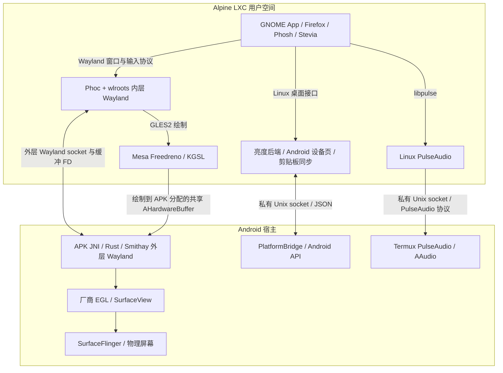
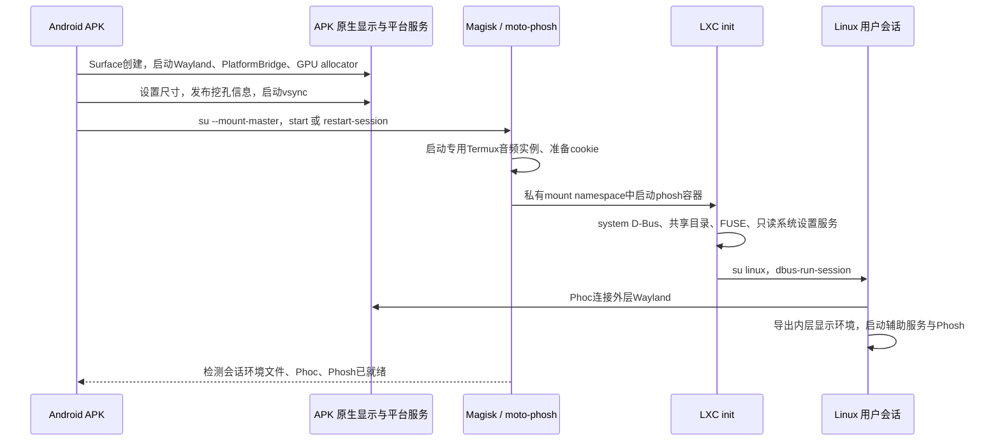
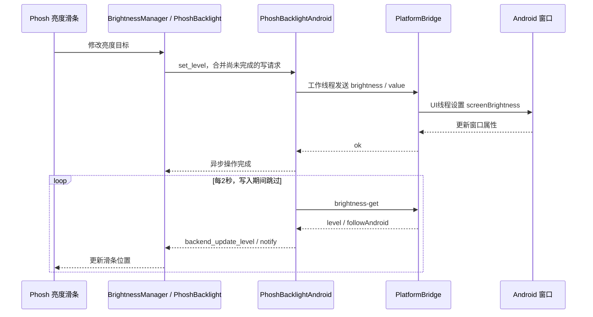

# Phosh 与 Android 后端的连接：架构、研究过程和维护方法

> 改名说明（2026-09-26）：Rungic改名B阶段之后，容器内的`moto-*`包、程序、单元、路径，`MOTO_*`变量和`dev.moto.*`名称改为`rungic-*`、`RUNGIC_*`、`com.rungic.*`；Android侧的名称在C阶段（2026-09-27）改为APK `com.rungic.plasma`、`/data/adb/rungic-*`（镜像在`/data/adb/rungic-lxc/images/`）、容器中的`/var/lib/rungic-{host,cores,apt}`、`rungic-gpu-alloc`、`rungic-cast`、`debug.rungic.*`、dm `rungic-root`与SELinux `rungic_image`。对照与边界见[70篇](../70-rungic-rebrand.md)。下文按时间记录的内容保留当时的名称。

> 历史研究记录：Phosh 专属实现已于2026-09-23移除。本篇保留共享硬件接口与研究结论；当前代码见 `shared/`、`native/plasma/`、`plasma/`，现行集成见 [40篇](../40-plasma-mobile-integration.md)。旧Phosh路径和已删除的原始日志不再作为可执行入口。

记录日期：2026-09-23。对应 moto g100s / XT2537-4，Android 16，Phosh/Phoc/Stevia 0.57.0，Linux 桌面 APK 2.3，Alpine edge 与统一 Mesa/KGSL 基线。本文依据本地实际源码、配置与上一轮实机证据整理；本次编写文档没有新增硬件验收。

**这套系统的连接方式是：Linux 应用继续使用 Wayland、PulseAudio、D-Bus/portal 等桌面接口；Android 继续管理屏幕和手机硬件；在两侧之间接入必要的显示、声音和设备接口。** Phosh 提供桌面界面，Phoc 管理 Linux 窗口，APK 提供 Android 上的显示宿主和部分硬件能力。LXC 提供 Linux 用户空间，复用手机内核。

**后续更新：原生网络桥已部署，见[32：Android 网络接入](32-network-integration.md)。下文网络规划描述的是补桥前的问题；第32篇记录最终对象、接口、GNOME补丁和实机验收。**

**采集更新：APK2.5接入AudioRecord/Camera2，Linux提供PulseAudio麦克风与PipeWire摄像头，见[33：麦克风、拍照、录像](33-capture-integration.md)。其中同时记录输出故障自动恢复、共享目录FUSE ABI修复和采集生命周期。**

**编解码更新：APK2.6的普通应用域运行MediaCodec；GStreamer插件和Firefox私有FFmpeg通过`/mnt/android-wayland/codec.sock`、独立控制FD及32MiB共享内存传帧。Firefox在沙箱前预连受限broker，fork子进程各持有独立连接；没有关闭内容/RDD沙箱。应用目录中的四个私有FFmpeg运行库用于统一Firefox各进程的后端，系统FFmpeg和Mesa保持原样。协议、安装路径、维护/回退与实机范围见[35篇](35-hardware-codec-integration.md)。**

同轮桌面调整：底部home栏恢复15逻辑像素，保留Android沉浸手势和顶部safe area；`phosh/session`禁用无可用密码的独立Linux锁屏，Phosh各锁屏入口遵从此设置。完整源归档与增量补丁位置见35篇。

## 阅读入口

2026-09-28 当前 Plasma 首次账户入口补充：APK → Magisk `--mount-master` → `rungic-plasma account-setup` → 公共 `start_container()` → LXC 内账户助手。容器入口绑定的宿主音频目录必须在所有启动路径上提前准备；`android-audio prepare` 复用目录创建和权限逻辑，普通桌面启动再以 `start` 启动音频服务。G100 全新安装曾在真正校验账户之前因目录缺失失败，修复及验收范围见 [79 篇](../79-g100-ci-execution.md)。

| 要回答的问题 | 文档 |
|---|---|
| 当时有哪些功能缺失、怎样测出来 | [28：能力审计](28-capability-audit.md) |
| 调查了哪些上游和类似项目，为什么选这条路线 | [29：复用研究](29-reuse-research.md) |
| 现在能用哪些功能，实测到了什么程度 | [30：功能适配记录](30-feature-adaptation.md) |
| 各层怎样连接、如何继续开发和排查 | 本文 |
| 源码、补丁、二进制与原始验收证据在哪里 | 本轮材料索引（历史材料已移除） |

第25、26、27篇保留原生Wayland、GPU、版本升级的历史过程。当前Linux图形库位于统一的 `/usr`；26篇早期 `/opt/moto-mesa` 的运行配置已被27篇替代。第30篇之后的新变化应继续更新状态记录，不能把本文的版本和验收结果视为永远有效。

## 1. 先分清各层的职责

| 层 | 实际组件 | 负责什么 | 不应据此推断什么 |
|---|---|---|---|
| Linux应用与外壳 | GNOME Apps、Firefox、Phosh、Stevia | 应用窗口、桌面、面板、输入法 | 装了设置App并不等于有Android硬件接口 |
| Linux合成器 | 自定义Phoc 0.57 + 静态嵌入wlroots 0.20.2 | 内层Wayland服务、窗口合成、输入焦点、layer-shell、屏幕采集 | 嵌套输出WL-1不等于物理屏幕控制器 |
| Linux桌面服务 | PulseAudio、D-Bus、PipeWire/WirePlumber、portal、GVfs、Keyring | 标准声音、共享屏幕、文件和凭据接口 | 服务进程存在还需验证实际后端与数据流 |
| Android显示宿主 | `dev.moto.phosh` APK，Java + JNI/Rust/Smithay | 外层Wayland服务、SurfaceView、厂商EGL、AHardwareBuffer、触摸、vsync | APK本身不包含整个Linux系统 |
| Android设备接口 | APK的 `PlatformBridge`；独立Termux PulseAudio实例 | Android窗口亮度、设备信息、系统设置入口、剪贴板；AAudio声音输出 | NetworkManager（含Wi‑Fi操作与调制解调器设备）、ModemManager、BlueZ子集模拟服务已接入（docs/73第四阶段）；GeoClue兼容服务未完成 |
| Android采集接口 | APK `CaptureBridge/CaptureService`；Linux `moto-media-bridge`、`moto-camera-source` | 普通Android权限、AudioRecord PCM→PulseAudio source；Camera2 YUV→PipeWire Video/Source | 可见且有消费者才采集；不代表硬编码、后台录像或完整Camera HAL直通 |
| 容器和控制入口 | Magisk、`moto-phosh`、`moto-phosh-enter`、LXC | 启停、挂载可见性、Linux文件系统、设备白名单 | 这不是具有独立内核的虚拟机 |

Android继续拥有物理显示模式、温控、网络连接、蓝牙栈、系统电源策略等。Linux应用尽量复用共同的标准服务，避免每个App单独配置一个Android适配方法。

### 1.1 显示和设备控制是两条连接



图中的JSON接口传设备状态和控制请求。桌面像素走Wayland/GPU缓冲，声音走PulseAudio。HTTP代理 `192.0.2.10:6152` 用于访问互联网，不参与这些本地IPC连接。

2.5另有 `/mnt/android-wayland/capture.sock`：麦克风PCM与相机YUV经私有socket进入Linux标准音视频服务；平台JSON的 `capture-info` 仅用于状态和规格。完整协议、按需启停和文件归属见33篇。

## 2. APK与桌面怎样接起来：两层Wayland

Phoc同时扮演两个角色：对于GNOME App，它是Wayland服务器；对于Android APK中的Smithay，它是一个Wayland客户端。APK显示的是Phoc合成出来的Linux桌面。

```text
GNOME App、Phosh、Stevia
  → 内层Wayland socket（由Phoc创建，位于 /run/user/1000）
  → Phoc / wlroots 的 Wayland backend
  → /mnt/android-wayland/wayland-0（APK创建的外层socket）
  → APK原生Wayland服务器 → Android SurfaceView → SurfaceFlinger
```

这两个socket可能具有相同的文件名，但目录、所有者和角色不同。**应用应连接Phoc的内层socket；Phoc的嵌套backend连接APK的外层socket。** 不能把 `/mnt/android-wayland/wayland-0` 当成所有GNOME应用的显示地址，否则会绕开Phosh窗口管理和内层协议服务。

session（历史材料已移除） 启动Phoc前设置外层 `WAYLAND_DISPLAY`。Phoc启动 `-E /usr/local/bin/moto-phosh-apps` 时提供内层显示环境；session-apps（历史材料已移除） 保存该环境到 `/run/user/1000/moto-session.env`，再启动Phosh、Stevia和辅助进程。user-exec（历史材料已移除） 先降为Linux用户，再导入这个文件，因此从电脑运行的图形程序可以加入正在使用的桌面。

会话还通过 `dbus-update-activation-environment` 把内层Wayland、XDG桌面身份、GTK渲染和图形驱动环境传给D-Bus。否则直接启动的App可能正常，而通过D-Bus激活的App/portal找不到同一显示或选错后端。

当前 phoc.ini（历史材料已移除） 设置 `xwayland=false`，常用竖屏输出为720×1600、scale=2。图像最终由Android映射到物理显示区域；旋转会调整实际输出尺寸。当前链路不经过X11或VNC。

### 2.1 GPU为什么需要单独的缓冲桥

Linux Mesa使用KGSL，Android APK使用厂商EGL。两套实现位于不同进程，各自服务对应用户空间；Linux内部必须保持同一套Mesa。

本机厂商EGL没有提供所需的 `EGL_EXT_image_dma_buf_import`。如果只让Linux分配普通DMA-BUF再交给APK，无法据此保证GPU直接导入。采用的方案是由Android分配双方都能使用的缓冲：

1. Phoc的定制wlroots allocator连接 `/mnt/android-wayland/moto-gpu-alloc`，请求宽、高和像素格式。
2. APK分配AHardwareBuffer，通过Unix socket的 `SCM_RIGHTS` 发送缓冲FD、stride和格式。
3. Phoc通过Mesa/KGSL导入FD，GPU直接画入该缓冲。
4. Phoc经外层Wayland提交缓冲。APK按FD的device/inode和尺寸/格式找到仍持有的AHardwareBuffer，以 `EGL_ANDROID_image_native_buffer` 建立EGLImage后显示。
5. 每个缓冲保留一个socket租约；Linux销毁缓冲时关闭租约，Android释放所有权。APK采样阶段另持有引用，避免过早释放。

相关源码：Android allocator（历史材料已移除）、[Linux allocator客户端](../../shared/graphics/gpu-allocator-client.h)、Phoc/wlroots补丁（历史材料已移除）、APK GPU补丁（历史材料已移除）。

协议使用小端整数。v1：请求为magic `0x4d475055`、width、height、fourcc共16字节；回复magic、字节stride、fourcc共12字节并携带一个FD，缓冲为LINEAR。v2（APK1.23起，KWin moto9）：magic `0x4d475056`，请求再附8字节期望修饰符，回复再附8字节实际修饰符；期望`DRM_FORMAT_MOD_QCOM_COMPRESSED`时宿主以高通私有usage位分配UBWC缓冲，并按dma-buf大小核对确为UBWC布局后才回报该修饰符，否则回报LINEAR（57篇）。服务限制尺寸和最多32个活动租约。该接口依赖APK私有父目录和受控挂载，**没有复制PlatformBridge的peer UID校验**，不能把两个服务的检查条件混写。

KWin输出现以sync_file显式同步（`zwp_linux_explicit_synchronization_v1`），宿主把该AHB直接交给SurfaceFlinger（零拷贝，窗口尺寸变化后先走GLES帧），KWin输出默认为UBWC；细节、开关与实测见57篇。此共享缓冲路径用于不透明桌面输出，内部透明缩略图、Phosh概览和屏幕共享还有GBM、读回或SHM路径。因此不把整个桌面称为全程零拷贝。

### 2.2 保持Linux图形库一致

gpu-env（历史材料已移除） 选中统一的 `/usr/lib/dri`、KGSL、Turnip ICD，开启 `FD_KGSL_ENABLE_DMABUF=1`，Phoc使用gles2，GTK4默认使用GL。GPU启用时清除私有 `LD_LIBRARY_PATH` 和 `LIBGL_ALWAYS_SOFTWARE`。

之前混用旧系统libGL和新私有Mesa导致符号/驱动不一致；现已将六个Mesa子包作为一套签名Alpine包部署并锁定内容哈希。Phoc静态嵌入wlroots，修改wlroots后必须重编Phoc，单换共享库不会改变它。实际renderer、像素读回、进程加载路径的验证记录见27篇（旧Phosh专属记录已删除），不能只查包版本或环境变量。

## 3. 启动顺序、挂载和生命周期

### 3.1 一次正常启动经过什么



对应入口：

| 环节 | 本地源码 | 部署位置/行为 |
|---|---|---|
| Activity、Surface、JNI、后台恢复 | MainActivity.java（历史材料已移除） | APK `dev.moto.phosh` |
| root控制器 | moto-phosh（历史材料已移除） | `/data/adb/moto-phosh/moto-phosh`；flock避免并发启停 |
| 挂载/进入LXC运行环境 | moto_phosh_enter.c（历史材料已移除） | `/data/adb/moto-phosh/moto-phosh-enter` |
| 容器定义 | phosh.config（历史材料已移除） | runtime内 `/var/lib/lxc/phosh/config` |
| 初始化与会话监督 | inittab（历史材料已移除）、init.sh（历史材料已移除）、session-supervisor（历史材料已移除） | `/etc/inittab`、`/usr/local/sbin/moto-phosh-init`、`moto-phosh-supervisor` |
| Phoc和桌面会话 | session（历史材料已移除）、session-apps（历史材料已移除） | `/usr/local/bin/moto-phosh-session`、`moto-phosh-apps` |
| 电脑管理入口 | moto_phosh.py（历史材料已移除） | 固定选择设备，调用上述控制器 |

首次创建原生服务器时APK调用 `restart-session`，使已运行的Phoc重新连接新的外层服务器；重新绑定仍存活的Surface时可调用 `start`。Surface销毁会暂停渲染，恢复时重新绑定；这与主动停止容器是不同操作。菜单“返回Android”把任务移到后台，“停止Linux桌面”才调用stop并释放显示连接。

`restart-session`清理旧环境文件并结束Phoc，由init的监督链重建用户会话；它会中断当前图形应用，不应作为无影响的刷新操作。`stop/start`还会重建容器的 `/run`、`/tmp`、FUSE和挂载。本轮分别验证了会话重启和完整容器重启，未把它等同于整机冷启动。

2026-09-23后续整机重启发现KGSL设备号会变化：外层控制器现于启动容器前stat读取 `/dev/kgsl-3d0` 与 `/dev/dma_heap/system`，通过 `lxc-start -s` 分别添加当前设备的rw/r权限，配置不再写死动态major/minor。直接绕过控制器运行lxc-start不会获得这两项启动参数；日常与APK均应使用moto-phosh入口。详情及恢复验收见[39篇](../39-magisk-daemon-crash.md)。

### 3.2 Android路径怎样进入Linux

Android上的LXC runtime是 `/data/adb/moto-lxc/runtime`；Phosh rootfs在其下 `var/lib/lxc/phosh/rootfs`。enter先创建私有mount namespace，将所需路径绑定到runtime，再 `pivot_root`，最后执行LXC工具。早期仅chroot时，pidfd attach可能把根目录恢复到Android；这就是这里使用pivot_root的原因。

| Android实际资源 | enter运行环境中的路径 | Phosh容器中看到的路径 | 用途 |
|---|---|---|---|
| `/data/user/0/dev.moto.phosh/files/tmp` | `/mnt/android-wayland` | `/mnt/android-wayland` | 外层Wayland、GPU allocator、平台socket、显示元数据 |
| `/data/data/com.termux/files/usr/tmp/moto-phosh-audio` | `/mnt/android-audio` | `/mnt/android-audio`，只读bind | 专用PulseAudio socket及认证材料 |
| `/storage/emulated/0/Linux` | `/mnt/phosh-shared` | `/mnt/android-shared` | Android公用Linux目录 |
| 上一行容器目录 | 容器内bindfs再映射 | `/home/linux/Shared` | 映射Linux用户读写身份 |
| `/dev/kgsl-3d0`、`/dev/dma_heap/system` | runtime的设备视图 | 容器内同名节点 | GPU命令、内存与共享缓冲 |

APK应用数据隔离namespace一度看不到Termux目录；root控制器使用Magisk `--mount-master` 后再创建自己的私有挂载空间，解决可见性问题。enter的新增挂载不留在Android原始mount namespace。

不要通过Android rootfs路径往正在运行的 `rootfs/tmp` 或 `rootfs/run` 上传会话文件：容器里的这两个目录被tmpfs覆盖。应使用 `moto_phosh.py exec/user-exec` 写入运行中的目录，或者先上传非覆盖路径再从容器内复制。

### 3.3 身份与设备边界

Linux桌面进程使用 `linux` / UID1000，APK是Android分配的普通应用UID，音频进程使用Termux UID。root只在容器控制/挂载/部署路径使用；浏览器和日常GNOME应用不以root运行。

该部署是rootful LXC，沿用已有Magisk宽松域；Android全局仍Enforcing，APK仍是普通应用域。Phosh容器共享Android网络namespace，丢弃NET_ADMIN/NET_RAW等能力。GPU节点按当前内核major/minor列入cgroup白名单；没有把物理显示控制器交给Linux。共享显示内存按APK的MCS类别重新标记容器私有 `/dev/shm`。

这是为同一用户桌面建立的本地连接；UID1000与私有目录检查不构成针对不可信Linux应用的完整权限隔离。摄像头、麦克风等未来能力仍需要各自的授权、生命周期与应用接口设计，不能因为root可调用就默认开放。

## 4. Android私有设备接口的契约

服务端是 PlatformBridge.java（历史材料已移除），socket为APK私有 `files/tmp/platform.sock`，容器地址为 `/mnt/android-wayland/platform.sock`。客户端包括 Android设备页（历史材料已移除）、亮度后端（历史材料已移除）、[剪贴板进程](../../shared/platform/clipboard.py)。

每次连接发送一行UTF-8 JSON，以换行结束；服务端返回一行JSON后关闭连接。正常操作返回结果对象，控制操作通常为 `{"ok":true}`；操作错误通常为 `{"error":...}`，连接/解析失败也可能直接关闭连接，客户端必须同时处理I/O错误。协议不是shell命令通道。

| `op` | 请求字段 | 结果/实际语义 |
|---|---|---|
| `status` | 无 | `version:1`，型号、Android版本、时区、窗口焦点、方向、窗口亮度、网络、电池 |
| `brightness-get` | 无 | `level`整数2–100、`followAndroid`；跟随时读取Android亮度设定值 |
| `brightness` | `value`：0.02–1，或-1 | 只修改当前Activity窗口亮度；-1恢复跟随Android |
| `orientation` | `mode`：`system` / `portrait` / `landscape` | 改Activity方向并保存偏好；system使用FULL_USER，尊重Android用户旋转策略 |
| `settings` | `target`：`network` / `bluetooth` / `display` / `sound` / `datetime` / `location` | 打开对应Android设置Activity或系统面板 |
| `vibrate` | 无 | Android一次35ms震动；当前仅为测试入口，不是feedbackd后端 |
| `clipboard-get` | 无 | `available`和`text`；null表示空；无焦点/非文本/敏感标记/超长时不可用 |
| `clipboard-set` | `text`：字符串或null | 设置纯文本，null清空；相同正文不重复设置 |

`status`、`brightness-get`可在没有窗口焦点时查询；其他控制操作要求 `Activity.hasWindowFocus()`。剪贴板读取另有前台与敏感标记检查。这个前台条件是窗口焦点，不是“Linux容器是否仍在运行”。

服务端检查peer UID为0或1000，socket权限0666依赖其私有父目录和受控挂载限制可达性；设置3秒socket读取超时和3秒UI线程任务等待，请求上限524288字节。客户端各有更小上限：设备页响应64KiB，亮度后端4KiB/2秒，剪贴板响应512KiB、文本UTF-8输入262144字节。Java侧文本长度上限65536按UTF-16单元计，Python侧另按字符串长度限制；不是任意长度内容转发。

只读查询示例，在项目目录运行：

```bash
python3 tools/moto_phosh.py user-exec /usr/local/bin/moto-platform \
  --request '{"op":"status"}'

python3 tools/moto_phosh.py user-exec /usr/local/bin/moto-platform \
  --request '{"op":"brightness-get"}'
```

这套JSON是我们自己的宿主接口。标准GNOME应用不会自动理解它：需要把它接进应用已经使用的后端，或者使用明确调用它的设备页。下面三种实现展示了不同的连接方式。

## 5. 实例一：把原生Phosh亮度滑条接到Android

目标是用户直接使用Phosh原有滑条。研究发现0.57已采用内部 `PhoshBacklight` 后端基类，旧版 `org.gnome.SettingsDaemon.Power.Screen` 思路不能直接驱动当前滑条；因此在Phosh内部新增一个小后端，而不是另造整套GNOME电源服务。



实现分三处：

1. backlight-android.c/.h（历史材料已移除） 实现异步set/finish和状态读取，GTask中执行socket I/O，避免卡住Phosh UI。generation检查避免旧轮询覆盖刚刚拖动的值。
2. Phosh集成补丁（历史材料已移除） 在monitor创建backlight时检测宿主socket，存在则用Android后端，否则保留原sysfs逻辑；新增json-glib构建依赖。
3. PlatformBridge（历史材料已移除） 在Android UI线程更新 `WindowManager.LayoutParams.screenBrightness`，只作用于Linux桌面窗口。

上游BrightnessManager继续负责滑条与亮度状态。验收先查 `org.gnome.Shell.Brightness.HasBrightnessControl=true`，再真正拖动滑条，读取Android `windowBrightness=0.53`，最后恢复-1并观察回传。这比“D-Bus能返回true”多验证了硬件侧操作路径。

跟随Android时回传的是 `Settings.System.SCREEN_BRIGHTNESS` 对应用户设定，不是实时自动亮度、实际发光量或温控后的面板输出。原生滑条拖动会进入窗口覆盖模式；“Android设备”页可恢复跟随。当前不提供第二套Linux自动亮度算法。

## 6. 实例二：让普通Linux应用共用Android声音输出

声音采用成熟的PulseAudio协议，因此播放器和浏览器无需认识我们的JSON接口：

```text
Firefox / Showtime / GStreamer / 系统提示音
  → Linux libpulse
  → 容器内PulseAudio，默认sink=android
  → module-tunnel-sink-new
  → unix:/mnt/android-audio/native
  → Termux UID下的专用PulseAudio 17.0-4
  → module-aaudio-sink，sink=android_output
  → Android AAudio / 音频系统 / 当前输出设备

需要在手机本机出声的流（语音助手从手机发起时，或用户在音量设置里选择）
  → 容器内PulseAudio，sink=android_phone（module-pipe-sink，FIFO 16 KiB）
  → media-bridge（按sink状态启停）
  → 私有capture.sock，op=phone-output，48 kHz双声道S16LE
  → APK CaptureBridge的AudioTrack，setPreferredDevice：有线/USB/蓝牙耳机优先，否则扬声器
```

| 配置 | 所在位置与职责 |
|---|---|
| android-audio（历史材料已移除） | 宿主 `/data/adb/moto-phosh/android-audio`；创建专用runtime/state、以Termux UID启停进程、复制认证cookie |
| android-audio.pa（历史材料已移除） | 宿主AAudio sink、Unix socket和空闲释放；独立于用户其他PulseAudio实例 |
| android-tunnel.pa（历史材料已移除） | 容器 `/etc/pulse/default.pa.d/50-android.pa`；48kHz双声道、cookie认证、2秒重连 |
| `audio-cookie` | 容器 `/etc/phosh/audio-cookie`，1000:1000/0600；部署时创建，不进通用归档 |

研究比较了Termux/Droidspaces与已有Winland Oboe桥。前者已经提供PulseAudio服务器、混音和AAudio后端，适合保持普通Linux应用接口；后者虽有音频JNI，但还需核对自定义传输、权限、缓冲和生命周期。本轮选取前者的音频部分，没有整体安装其X11/VirGL图形方案。

验收覆盖默认sink、真实AudioFlinger轨道、播放、宿主重连与容器重启。空闲时sink的 `SUSPENDED` 是释放音频设备的正常状态，不能单凭它判断无声。第33篇已增加反向AudioRecord输入流和Android录音授权；输出sink的monitor不是麦克风。`android-audio watch`现在探测专用宿主PA的响应，连续两次失败后只重启经UID/路径/配置校验的专用实例，约30秒故障恢复已实测。

## 7. 实例三：让Firefox通过标准portal共享桌面

```text
Firefox getDisplayMedia
  → session D-Bus：org.freedesktop.portal.Desktop / ScreenCast
  → xdg-desktop-portal 按 phosh-portals.conf 选择wlr后端
  → 自定义portal-wlr + 用户确认框
  → Phoc 的 screencopy / image-copy 协议采集Linux桌面
  → PipeWire流，交还node与remote FD
  → Firefox取得视频帧
```

这里复用的是Linux桌面采集协议，不需要把整个Android屏幕再录制一遍。PulseAudio负责音频，PipeWire/WirePlumber负责图像流。第33篇新增的摄像头走Camera2/PipeWire Video/Source；屏幕共享的portal-wlr路线保持原样。

三个必须同时满足的条件：

1. **服务发现正确。** session-apps（历史材料已移除） 导入XDG桌面身份和内层显示环境；portals.conf（历史材料已移除） 显式选择ScreenCast/Screenshot的wlr后端，不能仅依赖“包已装”。
2. **缓冲协商适用于KGSL。** portal-wlr0.8.4在没有GBM设备时仍查询DMABUF格式并崩溃。GDB定位到NULL gbm调用；补丁（历史材料已移除） 跳过不成立的DMABUF分支，使用上游已有SHM路线。桌面正常显示路径仍为GPU。
3. **用户能看到确认框。** 普通GTK窗口曾被Firefox遮住；share-chooser.py（历史材料已移除） 使用gtk4-layer-shell覆盖层和键盘焦点，允许取消或明确共享。返回上游期待的原始输出选择字符串。配置（历史材料已移除） 上限30fps。

先用 test-portal.py（历史材料已移除） 验证CreateSession/SelectSources/Start/OpenPipeWireRemote到GStreamer采集，再验证真实Firefox getDisplayMedia、live状态和canvas像素，最后检查重启后仍可采集。测试完成关闭session/tracks，避免把“浏览器弹出了选择框”误当成已经有视频流。

## 8. 其他通路如何复用上述结构

| 能力 | 完整连接 | 关键语义与源码 |
|---|---|---|
| 触摸 | Android MotionEvent → JNI/Rust → 外层 `wl_touch` → Phoc → 有焦点的应用或Phosh | 保留触点ID和down/move/up，按Surface大小换算缓冲坐标；MainActivity（历史材料已移除）、触摸补丁（历史材料已移除） |
| 中文输入 | GTK等客户端text-input → Phoc → Stevia input-method → UIM候选 → Phoc提交文字 | 本轮已验证路线在Linux内部；Stevia补丁（历史材料已移除）。Android IME另有可选入口，未当作通用完整中文方案验收 |
| 收起键盘 | Android返回键 → 当前Android IME，或root控制器的hide-keyboard → 用户session D-Bus `sm.puri.OSK0.SetVisible(false)` | 先查Visible，已隐藏时才打开APK菜单；无需杀死Stevia |
| 剪贴板 | 内层Phoc data-control ↔ wl-paste/wl-copy ↔ moto-clipboard ↔ PlatformBridge ↔ ClipboardManager | 绕开不必要的外层selection中转；前台同步、去重、限长、跳过敏感标记；[clipboard.py](../../shared/platform/clipboard.py) |
| 网络/设备页 | GTK4/libadwaita设备页 → JSON status/settings → ConnectivityManager等真实API/Android设置 | 数据采集与控制分别处理；platform.py（历史材料已移除）。这个页面不能自动替代GNOME的NetworkManager接口 |
| 挖孔 | WindowInsets/DisplayCutout/RoundedCorner → 原子INI → Phosh文件监视 → 顶栏/exclusive zone/应用可用高度 | android-display.c（历史材料已移除），按当前mode和scale换算；不是为整个画面再叠一条永久黑边 |
| 刷新 | Choreographer → JNI frameTick → Rust条件变量 → 合成和frame callback；EGL成功提交累计。静止400ms后按需停发vsync：合成线程改为poll Wayland fd与kick eventfd，恢复时经eventfd通知Java主Looper（57篇） | DisplayPacer（历史材料已移除）、frame clock（历史材料已移除）、Rust补丁（历史材料已移除） |
| 横竖屏 | 设备页orientation → Android Activity方向 → Surface尺寸/触摸换算/INI → Phoc输出与Phosh布局 | 同步更新坐标、模式、安全区域；旋转修复（历史材料已移除） |
| 文档共享 | GNOME/portal → 容器私有FUSE → 文档导出；公共文件另经bindfs访问 | init.sh（历史材料已移除）。容器节点10:229/0666，Android原 `/dev/fuse` 仍0600 |
| 相机/麦克风 | Android普通授权 → 私有capture.sock → 标准PA source / PW Video/Source → GNOME/Firefox | [media-bridge.py](../../shared/media/media-bridge.py)、[camera-source.cpp](../../shared/media/camera-source.cpp)。session-apps自动启动，flock防重复；后台释放设备 |
| 手机本机输出 | 应用选`android_phone`（“手机本机”）sink → module-pipe-sink FIFO → media-bridge → capture.sock `phone-output` → APK AudioTrack（指定本机设备） | [media-bridge.py](../../shared/media/media-bridge.py)、`CaptureBridge.phoneOutput`。默认sink仍为跟随Android路由的`android`；投屏时两路并存（实测APK音轨在SPEAKER输出线程、Termux音轨在PROXY）。见59篇 |
| 长按Home呼出语音助手 | Plasma Mobile导航栏Home按钮长按400 ms → 任务栏C++ `assistantHold` → D-Bus `dev.moto.VoiceAssistant /Assistant Hold` → 常驻悬浮层（layer-shell，按需加载KWin blur/contrast）→ 语音服务`AssistantTalk`/`ReleaseTalking` → 固定的助理对话；实时语音在按下时才连接，麦克风音频先在本地排队 | [67篇](../67-home-assistant.md)。vendor plasma-mobile的导航按钮新增`holdable`；单击Home发`Hide` |
| 状态栏、导航栏跟随应用配色 | 应用声明配色方案（`qApp` 属性 `KDE_COLOR_SCHEME_PATH`，KColorSchemeManager 也是这样做的）→ plasma-integration 平台主题 → Wayland `org_kde_kwin_server_decoration_palette` → KWin `Window::colorScheme` → convergentwindows 脚本的 `WindowColors.qml`（窗口激活或配色变化时）→ D-Bus `org.kde.plasmashell /Mobile setActiveWindowColorScheme(屏幕, 配色)` → `ShellDBusObject::windowBackground()` 读取 .colors 文件 → 状态栏（Header 组）和导航栏（Window 组）用应用的颜色；深色背景时前景换成 Complementary | [59篇](../59-voice-agent.md)“面板跟随应用配色”。标准协议，所有声明了配色方案的 KDE/Kirigami 应用都适用；没有声明的应用（KWin 记为 `kdeglobals`，例如微信、系统设置）保持主题配色 |
| 电脑操作（语音助手，方案一，默认） | Codex Agent → MCP `moto-desktop` → `desktop_goal`：gpt-6-luna Responses API `computer`工具看助理屏截图（KWin ScreenShot2，JPEG q85）决定动作；或`desktop_screenshot`/`desktop_act`由Codex主模型直接看图操作 → 同一执行器：XDG RemoteDesktop门户 + KWin `commitText` | [68篇](../68-luna-computer-use.md)。不读无障碍树、不做OCR |
| 电脑操作（方案二） | Codex Agent → MCP `moto-desktop`（`moto-cua`，沙箱外）→ arc-cua运行时 + JEV → 观察：AT-SPI（流水线D-Bus）+ KWin一次性脚本`callDBus`；执行：XDG RemoteDesktop门户（KWin fake-input，相对移动）与宿主`text-commit` | [60篇](../60-computer-use.md)。应用收到的是普通Wayland键鼠事件；AT-SPI动作仅作兜底 |
| 网络文件 | Nautilus/GIO → GVfs对应协议后端 → WebDAV/SMB/NFS服务器 | WebDAV中文读写已实测；SMB/NFS仅安装后端，未验用户网络盘 |
| 共享存储（XDG用户目录） | `~/Shared` bindfs → Android MediaProvider FUSE（`/storage/emulated/0/Plasma`） | [69篇](../69-filesystem-capabilities.md)：已去掉`--direct-io`，恢复共享映射和SQLite WAL；符号链接、大小写、执行等是Android FUSE本身的限制；`moto-fs-audit`用于检查 |
| 外接显示（Miracast） | Android WFD显示 ← 宿主悬浮窗SurfaceView/Presenter ← 宿主额外wl_output“Moto Cast” ← KWin(moto11)输出CAST-n的全屏toplevel；Plasma经KScreen进入docked模式 | [58篇](../58-miracast-desktop-feasibility.md)第2步；宿主`cast.rs`、KWin `wayland_display/backend/output`、kscreenosd补丁。连接由root工具`moto-cast`；Linux入口（快捷开关“投屏”、`/usr/local/bin/moto-cast`、语音助手）经平台桥`cast`调用它，电视端断开由`moto-cast-watch`自动重连（第5步） |
| 投屏触控板/键盘 | 手机`CastControls`触控面板 → `NativeBridge.castPointer` → 宿主`cast_pointer`（wl_pointer只进投屏窗口）→ KWin输出CAST-n（软件光标）；Android输入法 → 已有按键/文字通道 → 宿主wl_keyboard或text-input-v3 → KWin `commitHostText` → 焦点应用 | 58篇第3步。text-input-v3路径同时让手机模式下的Android输入法能提交中文；键码表已按input-event-codes改正。双指滚动经KWin嵌套后端转给应用时保留手指来源与axis_stop，并按输出缩放换算（KWin moto17，66篇） |
| 凭据 | GNOME应用/libsecret → session D-Bus Secret Service → GNOME Keyring；Seahorse管理 | 使用上游服务；首次持久钥匙串由用户设密码，容器没有可用于PAM自动解锁的真实登录口令 |

显示元数据有两个文件：`/mnt/android-wayland/android-display.ini` 保存安全区域，坐标单位是Wayland帧缓冲像素；`android-refresh.ini` 保存Android报告Hz、支持范围、请求Hz与APK成功提交fps。两者都通过AtomicFile发布，避免读到半写入文件。

本机竖屏安全顶部115物理像素先转成约77缓冲像素，再按scale=2和留白得到43逻辑像素的Phosh顶栏。旋转曾使代码使用“历史最大输出宽度”，回竖屏顶栏错误变大；修正为当前mode宽度后连续两轮恢复正常。必须同时核验坐标单位和当前模式，单改一个padding数值不能解决这类错误。

刷新策略是触摸后请求最高120Hz并保持2秒；持续画面提交达到阈值时请求至少60Hz，静止后释放请求。Android显示策略和温控仍可覆盖它。实测交互约89fps，静止约2fps空闲提交；GNOME嵌套输出的refresh=0仍表示未知，不能填一个虚构120Hz模式来“补齐”设置页。

## 9. 我们是怎样研究、验证和逐步修正的

### 9.1 每个功能沿用同一个研究顺序

这套顺序来源于用户明确要求，已记录到 [AGENTS.md](../../AGENTS.md)。

1. **先定义用户动作与完成标准。** 例如“播放视频能听见声音”，要包含应用、Linux sink和Android输出轨道；“共享屏幕”要获得真实视频帧；“设置有亮度滑条”要实际改变窗口并能回传。
2. **定位缺失层。** 依次查应用接口、服务注册、进程环境、IPC、缓冲/权限、Android API或内核能力。环境变量、服务缺失、ABI混用和硬件后端缺失是不同故障。
3. **广泛比较已有工作。** 查上游、类似Android容器、手机Linux项目和实际源码。记录版本/提交、依赖、许可证与本机差异；区分“源码有实现”“包已安装”“本机已通过”。
4. **先做一条最小真实链路。** 图形读回像素、声音经过真实sink、中文候选提交、共享取得PipeWire帧。此时先不加大量UI或全局兼容层。
5. **把证明可行的链路接进共同入口。** 选择标准服务、Phosh内部后端或私有设备页；补启动顺序、后台/重连、错误处理和状态回传，避免每个App重复配置。
6. **在普通用户和真实应用里验收。** 既测协议，也测Firefox/GTK等调用者。调试profile和测试文件独立，避免编辑用户未保存草稿或覆盖个人设置。
7. **重启与清理后再确认。** 检查单实例、挂载、环境、cookie、库版本；确认Docker和已有Alpine容器仍正常；移除临时编译包、监听端口、转发和输入探针。
8. **同时留下结论与可复查材料。** 保存补丁、固定源码、构建参数、包锁、产物哈希、测试结果和未完成边界。测试未覆盖的部分继续列为待验收。

### 9.2 实际遇到的问题如何改变了方案

| 当时的现象或候选 | 找到的关键证据 | 最终处理 | 为什么不能只用表面现象判断 |
|---|---|---|---|
| 想直接显示Wayland，比较原型与现成项目 | Winland/Smithay已有可与Phoc连接的Wayland/JNI基础；Termux:X11属于另一显示路线 | 保留原生Wayland基础，补触摸、GPU、调度和宿主接口 | 项目README支持Wayland，不等于本机GPU和输入已打通 |
| Linux缓冲传到APK仍可能走CPU | 厂商EGL缺少所需DMA-BUF导入扩展 | Android先分配AHardwareBuffer，Linux导入绘制 | 看见GPU renderer名称不能证明跨进程显示没有回读 |
| GTK/设置出现图形库混用 | 进程maps和依赖显示不同版本libGL/EGL/Gallium | 六个Mesa子包统一到/usr，D-Bus环境一致 | 改LD_LIBRARY_PATH只能覆盖部分启动路径 |
| 设置App因空显示mode列表崩溃 | Phosh忽略refresh=0的有效嵌套输出，GNOME触发断言 | 保留有效宽高模式，0继续表示未知刷新率 | 给UI伪造60/120Hz会掩盖输出后端语义 |
| 音频只有Dummy Output | libpulse查询只有auto_null，实际无宿主出口 | 复用Termux AAudio后端和PulseAudio tunnel | ALSA卡名可读或GStreamer运行并不证明扬声器收到声音 |
| 浏览器宽度不适合手机、中文未生效 | 桌面UI裁切；firefox-intl包为空；分发扩展未自动加载 | mobile-config-firefox移动布局，标准policy安装官方中文XPI | 包名含intl或偏好写了zh-CN都不是中文UI证据 |
| Firefox报告软件合成 | KGSL无DRM节点触发分类问题；实际Mesa FD710可绘制 | 可修改的WebRender默认值，验证WebGL像素/视频和sandbox | 图形兼容修复没有要求关闭网页沙箱 |
| Stevia拼音每键被取消 | GTK preedit布局反馈触发OTHER，但周围文字/选区没变 | 仅在真实文本/选区等变化时重置completer | 已有UIM引擎无需先替换整套输入法 |
| portal有确认框却没有流 | GDB定位无GBM时的格式查询崩溃；一般GTK确认框又会被Firefox盖住 | 条件化DMABUF协商，使用SHM；确认框改layer-shell | 服务名存在、窗口弹出都不代表采集链已经完成 |
| 文档portal无法挂载 | root-only宿主/dev/fuse节点绑定进容器 | 容器私有FUSE节点，保留宿主权限 | 不需要为一个Linux服务修改Android全局设备权限 |
| 原生亮度滑条不可用 | 0.57实际使用PhoshBacklight，WL-1没有物理sysfs connector | 小型Android backlight后端 | 旧GNOME接口教程不一定适用于新Phosh架构 |
| 横屏回来顶栏变大 | safe area使用历史最大mode宽度 | 使用当前mode，验证两轮切换和缩放 | 单次竖屏截图无法覆盖旋转后的状态 |

早期对比的Droidian/libhybris、gst-droid/droidmedia、Waydroid、bluebinder等仍保留在29篇：有些运行方向不同，有些假设自己拥有Android HAL/蓝牙控制器。它们可以提供源码与协议参考，本轮没有将它们整体装进保留完整Android的LXC。未采用不表示项目不能用；只是当前设备和已验证范围不支持直接作此结论。

### 9.3 证据应该能回答哪一层已经通过

| 要确认的结论 | 已保存的本地证据 |
|---|---|
| 查过哪些来源，而非凭旧教程猜测 | fetches.json（历史材料已移除）、[29篇](29-reuse-research.md)、亮度/凭据补充核验（历史材料已移除） |
| 浏览器真实GPU/沙箱/中文状态 | 前后诊断（历史材料已移除）、WebGL与视频（历史材料已移除） |
| 原生亮度滑条确实到达Android | 窗口亮度结果（历史材料已移除） |
| 浏览器真的拿到了共享帧 | Firefox共享结果（历史材料已移除）、portal重启后采集日志（历史材料已移除） |
| 中文问题与修复有可重复输入 | 独立输入探针（历史材料已移除）、连续输入画面（历史材料已移除）、Stevia补丁（历史材料已移除） |
| 跨系统复制含中文/换行/emoji且能恢复 | 普通剪贴板测试（历史材料已移除）、敏感标记测试（历史材料已移除） |
| 并非依赖一次性的手工启动 | 完整容器重启记录（历史材料已移除）、清理后的最终检查（历史材料已移除） |
| 设备文件与保存的产物一致 | 逐文件SHA256/权限（历史材料已移除）、归档校验（历史材料已移除） |

相应测试脚本保留在电脑refs中；手机端临时探针已清理。需要复跑时先部署对应脚本到适当路径，不能照抄旧调试路径并假定仍存在。浏览器诊断脚本要求独立测试profile和临时Marionette环境；不应直接连接用户日常profile。

## 10. 排查时按连接顺序走

下面是在 `/home/kevinzhow/moto` 下运行的检查命令，使用现有工具固定选择目标设备。D-Bus查询可能按需激活相应服务，但不修改用户配置。

```bash
# 容器及会话日志
python3 tools/moto_phosh.py status
python3 tools/moto_phosh.py log

# 内层会话环境、外层宿主socket与显示元数据
python3 tools/moto_phosh.py user-exec sh -c \
  'printf "Wayland=%s Runtime=%s\n" "$WAYLAND_DISPLAY" "$XDG_RUNTIME_DIR"; ls -l /mnt/android-wayland; cat /mnt/android-wayland/android-refresh.ini'

# 已部署图形库/进程加载路径审计
python3 tools/moto_phosh.py exec /usr/local/bin/moto-graphics-audit

# Linux声音出口；空闲SUSPENDED本身不是失败
python3 tools/moto_phosh.py user-exec pactl list short sinks

# 原生Phosh亮度能力
python3 tools/moto_phosh.py user-exec gdbus call --session \
  --dest org.gnome.Shell.Brightness --object-path /org/gnome/Shell/Brightness \
  --method org.freedesktop.DBus.Properties.Get \
  org.gnome.Shell.Brightness HasBrightnessControl

# 文档portal是否能建立导出目录
python3 tools/moto_phosh.py user-exec gdbus call --session \
  --dest org.freedesktop.portal.Documents --object-path /org/freedesktop/portal/documents \
  --method org.freedesktop.portal.Documents.GetMountPoint
```

| 症状 | 先看哪里 | 如何判断下一步 |
|---|---|---|
| APK有外框但无桌面 | Android的MotoWayland日志、外层socket、Phoc与session.log | 没socket查APK初始化；有socket而Phoc失败查backend/环境/挂载；Phoc正常再查Phosh |
| 终端启动正常，点击图标失败 | `moto-session.env` 与D-Bus激活环境、App日志、maps | 优先确认内层Wayland和统一Mesa环境，不先换渲染库 |
| 有画面但滑动卡顿 | android-refresh.ini、Android显示/温控信息、提交帧计数 | 区分请求Hz、Android报告Hz、物理mode、成功提交fps和内容帧率 |
| 显示按钮却操作无效 | Linux后端请求、PlatformBridge返回、Activity焦点 | `ok`后再验证宿主状态；无焦点错误不等于缺root权限 |
| 原生Wi-Fi页显示未连接但浏览器联网 | 设备页status与NetworkManager服务是否存在 | 当前可能是标准GNOME接口缺失，而非实际断网；不要启动NM接管Android网卡来“修UI” |
| 无声 | sink是否android、tunnel、cookie权限、宿主专用Pulse日志、AudioFlinger | 按两端逐段查；不输出cookie正文 |
| 共享确认后失败 | session.log、pipewire.log、wireplumber.log、portal后端与输出格式 | 区分D-Bus选择、确认交互、格式协商、PipeWire与浏览器消费 |
| 键盘不收起/中文被取消 | OSK Visible、输入焦点、Stevia keyboard.log | 先查状态与text-input事务；协议日志只使用专用测试文字 |
| 旋转后布局不对 | Android视图尺寸、INI、Phoc当前mode/scale、Phosh safe-area日志 | 核对物理/缓冲/逻辑三种坐标，避免只改最终像素常量 |

需要主动重启验证时，先保护当前图形应用中的工作，再使用 `restart-session` 或 `stop`、`start`。诊断命令成功只证明它检查的那一层，不能替代真实应用验收。

## 11. 后续功能怎样选择接入点

按“桌面原本向谁请求这个能力”决定接哪一层：

| 后续目标 | 已有基础 | 尚需研究/实现的连接 |
|---|---|---|
| 麦克风/会议音频 | 第33篇已提供标准source、录音/视频/浏览器采集与可见状态控制 | 后续需验证音频焦点、耳机/蓝牙路由、长会议和精确音画同步 |
| Plasma网络、Wi‑Fi与蜂窝设置页 | NetworkManager模拟服务：接入点、已保存网络、连接/断开/忘记；ModemManager模拟服务：SIM、运营商、信号；移动数据开关对应Android `svc data`（docs/73） | 保留Android连接所有权；SIM PIN、选网、APN、数据漫游与VPN管理仍在Android设置 |
| 蓝牙 | BlueZ子集模拟服务（`org.bluez`，无bluetoothd、无HCI）：bluedevil/bluetoothctl的开关、搜索、配对、连接由Android蓝牙API完成（docs/73） | 配对在Android弹窗确认；音频路由仍由Android决定；OBEX文件传输未接入 |
| 摄像头/定位/传感器 | 第33篇已接Camera2→PipeWire→GNOME/GStreamer/Firefox | 摄像头长时间/后台与硬编码仍缺失；定位/传感器需另行比较Location→GeoClue、Sensor→iio-sensor-proxy |
| 应用震动反馈 | vibrate测试请求已到Android | 研究feedbackd后端与事件/强度/取消语义；不是把测试按钮当成应用通用支持 |
| 视频硬解/硬编码 | GPU绘制与软件编解码已验收；第34篇验证Android高通AVC/HEVC硬编→硬解，原厂V4L2节点可枚举 | Linux后端未接通；先验证现成V4L2帧流兼容性，再比较MediaCodec桥与gst-droid/droidmedia维护成本，Firefox需独立适配，见[34篇](34-hardware-codec-audit.md) |
| 内容索引 | LocalSearch应用存在 | 核对并补Landlock内核能力、ABI和原厂模块兼容；保留提取器隔离 |
| 图形应用更新 | Alpine包管理与固定Mesa清单 | 更新事务、版本约束、失败恢复与KGSL运行时一致性；不是直接套用未验证的Flatpak图形栈 |

新功能的本地记录至少应包含：用户动作/验收目标、当前缺失层、候选与固定源码、许可证、本机差异、选用与放弃原因、两端接口契约、权限和数据所有权、启动/停止/重连、补丁/构建/部署位置、真实应用证据、回退方法与未验收边界。实现前继续广泛核对，而不是把29篇的一次检索当成所有后续功能已经完成研究。

## 12. 维护与复现时以哪些文件为准

| 修改类型 | 需要更新的材料与产物 |
|---|---|
| Android界面、权限、平台op、旋转/Insets | `phosh/native-apk/`，运行 build-native-apk.sh（历史材料已移除） 重建并沿用原签名；必要时同时更新Linux客户端 |
| 外层Wayland、GPU allocator、frame clock | `native/phosh/` 内实际编译源码，更新 `phosh/` 中对应镜像/补丁；先 build-native-core.sh（历史材料已移除），再打APK |
| 内层Phoc/wlroots | 在0.57/wlroots0.20.2基线上更新补丁并重编静态嵌入库；部署 `/opt/moto-phoc/bin/phoc`，随后验收实际渲染 |
| Phosh原生后端/顶栏/手势 | 更新0.57源码与补丁，重建 `/usr/local/lib/moto-phosh/phosh`；当前亮度、旋转补丁叠加在27篇基线上 |
| Stevia/portal补丁 | 分别重编独立的Stevia和portal-wlr二进制；确认启动脚本或D-Bus service选中自定义路径 |
| 会话/设备页/剪贴板/选择器 | 修改 `phosh/` 脚本并同步到部署路径；根据进程是否常驻决定重新启动组件或会话 |
| 挂载与容器初始化 | 更新config/init；enter源码变化用 build-launcher.sh（历史材料已移除） 重编；新的挂载配置需完整容器重启验证 |

`phosh/native-frame-clock.rs`、`phosh/native-gpu-allocator.rs`等是保存的源码镜像；`build-native-core.sh`实际编译refs里的native工程。只修改镜像而不同步实际源树，构建结果不会包含变化。`phosh/native-vsync.patch`以已做过触摸/GPU适配的Winland源码为前提，不能单独覆盖到任意上游版本。

APK、定制Linux二进制、源码、包清单、宿主manager/enter/config分别保存在 本轮材料目录（历史材料已移除）。`feature-binaries.tar.gz`是明确列出文件的功能层快照，不含整个Linux rootfs、用户home、cookie或签名私钥；只装APK不能重建当前桌面。源码归档已包含修改的文件时，不再重复应用同一补丁。

在项目目录可核对上一轮保存的产物：

```bash
sha256sum -c .work/refs/phosh-features-20260923/SHA256SUMS
```

构建工具脚本仍包含本机路径，Alpine edge会变化，当前未提供全新电脑/空设备的一键复现流程。原有Fastboot包未合入这些功能；第26篇旧GPU安装器冻结于旧Alpine基线，不能用于覆盖当前edge环境。

来源与许可证随各组件保留：Phosh/Stevia修改遵循其GPL-3.0-or-later，portal-wlr补丁遵循MIT；其他依赖以各自源码许可为准。Winland固定提交的项目级授权未明确，29篇已记录；公开仓库不自动等于可任意重新授权分发。当前材料用于本地开发和回溯。

功能状态与未完成事项统一维护在[30篇](30-feature-adaptation.md)，接口和连接方式维护在本文，原始来源与实测证据保存在refs。这样版本升级时可以分别判断：需要重新研究的接口、需要迁移的补丁，以及需要重新运行的验收。

2026-09-23桌面启动补修：发现Firefox发行版desktop三个Exec直接调用原程序，绕过编解码包装入口；之前只测命令行漏检了此路径。新增`phosh/install-firefox-launcher.py`生成同ID用户desktop覆盖，普通启动/新窗口/隐私窗口均走包装脚本。恢复步骤、原始问题证据与桌面启动复测见修复记录（历史材料已移除）。

2026-09-23输入验证流程修正：Marionette仅连接显式独立测试profile，禁止用日常profile保存自动化偏好。真实屏幕键盘需独立验收：焦点/ASCII提交、中文preedit与候选、正常退出确认与新进程启动。此前残留focusmanager.testmode触发Firefox154空指针，已清理，见[36篇](../36-firefox-input-fix.md)。迁移glibc发行版时保留Android接口契约、重编Linux侧二进制并验证会话服务，详见[37篇](../37-linux-distribution-evaluation.md)。

## 调试与性能观测入口（2026-09-24）

Agent可直接调用的设备诊断、崩溃现场、统一追踪（perfetto + KGSL + KWin FTrace）与按控件操作见[55篇](../55-agent-native-debugging.md)；入口为工作区`.mcp.json`中的`moto` MCP服务及`tools/rungic_agent.py`等命令行。桌面输出链的分段耗时与GLES/Vulkan对照见[56篇](../56-kwin-vulkan-quantification.md)。

## 名称对照（Rungic改名，B阶段2026-09-26，C阶段2026-09-27）

容器内的接口在B阶段改名，Android侧在C阶段随APK改名（切换工具`tools/rungic_cutover.py`，docs/70）；本文上面的描述保留原名。

| 位置 | 改名前 | 改名后 |
|---|---|---|
| 包 | `moto-plasma-*`、`moto-codec`、`moto-cua`等；发布元包`moto-plasma-release` | `rungic-plasma-*`、`rungic-codec`、`rungic-cua`等；`rungic-release` |
| 会话与桥接单元 | `moto-plasma-session`、`moto-plasma-{display,brightness,media,clipboard,network,shared}`、`moto-voice-{agent,overlay}`、`moto-coredump.path` | 同名`rungic-*` |
| D-Bus | `dev.moto.VoiceAssistant`、`dev.moto.VoiceAgent`（`/dev/moto/VoiceAgent`）、`dev.moto.Cua`（`/dev/moto/Cua`）、`dev.moto.Android.{Power,Network}` | `com.rungic.*`（对象路径`/com/rungic/*`） |
| 编解码 | GStreamer `motoh264enc`/`motoh26{4,5}dec`/`motovp9dec`，FFmpeg `h264_moto`等，`libmotocodec.so` | `rungich264enc`等，`h264_rungic`等，`librungiccodec.so` |
| 相机 | PipeWire节点`moto.camera.N`、`device.api=moto-android`，libcamera相机`moto-pipewire-{back,front}` | `rungic.camera.N`、`rungic-android`、`rungic-pipewire-{back,front}` |
| KWin与显示设置 | `MotoDisplay`命名空间（`android-display-client.h`） | `RungicDisplay` |
| APK | `dev.moto.plasma`（Java包同名，日志标签`Moto*`，标签“Plasma Mobile”） | `com.rungic.plasma`（`Rungic*`，“Rungic”） |
| Android侧目录与程序 | `/data/adb/moto-{plasma,lxc,wfd}`，`moto-plasma`、`moto-plasma-enter`、`moto-lxc`、`moto-cast`；镜像`…/lxc/plasma/images/` | `/data/adb/rungic-{plasma,lxc,wfd}`，`rungic-plasma`、`rungic-plasma-enter`、`rungic-lxc`、`rungic-cast`；镜像`/data/adb/rungic-lxc/images/` |
| 镜像设备与SELinux | dm `moto-plasma-root`/`moto-plasma-before`，`moto_plasma_image` | `rungic-root`/`rungic-before`，`rungic_image` |
| 容器绑定挂载点 | `/var/lib/moto-{host,cores,apt}` | `/var/lib/rungic-{host,cores,apt}`（旧名同时挂载到D阶段） |
| APK与KWin之间 | `/mnt/android-wayland/moto-gpu-alloc`，投屏输出厂商“Moto” | `rungic-gpu-alloc`（APK保留`moto-gpu-alloc`链接），厂商“Moto”保留到D阶段（KWin两者都认） |
| 其他 | `debug.moto.*`，Termux音频目录`moto-plasma-audio`，LXC主机名`moto-plasma` | `debug.rungic.*`，`rungic-plasma-audio`，`rungic` |
| Docker | `/data/adb/moto-docker`、`moto-docker`，SELinux `moto_docker`、`moto_docker_file`、`moto_docker_image`，链`MOTO_DOCKER_*` | `/data/adb/rungic-docker`、`rungic-docker`，`rungic_docker*`，`RUNGIC_DOCKER_*`（`rungic_cutover.py docker-up`） |
| 保持不变 | ROM中的Magisk引导脚本随下次刷机 | — |
