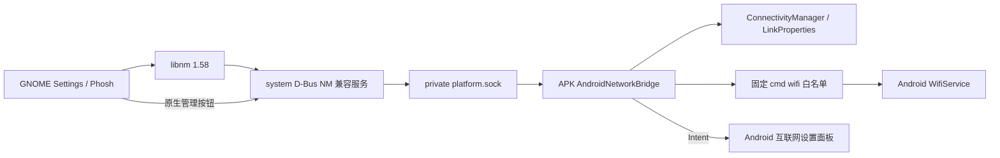

# Android 网络接入 GNOME / Phosh

> 历史研究记录：Phosh 专属实现已于2026-09-23移除。本篇保留共享硬件接口与研究结论；当前代码见 `shared/`、`native/plasma/`、`plasma/`，现行集成见 [40篇](../40-plasma-mobile-integration.md)。旧Phosh路径和已删除的原始日志不再作为可执行入口。

2026-09-23。已部署到 ZY32MVJS25：桌面 APK 2.4 / versionCode 7，GNOME Control Center 51.0 Android 网络补丁，NetworkManager D-Bus 子集服务 v1。全局 SELinux 保持 Enforcing。

## 用户入口

- 设置 → 网络：显示 Android 当前连接和 IPv4，点“Android 网络”直接打开系统互联网面板。
- 设置 → Wi-Fi：显示真实连接、信号及开关；齿轮详情显示安全方式、频率/链路速率、IPv4/IPv6、MAC、DNS和网关。
- “在 Android 中管理网络”：选其他网络、输入密码、管理已保存连接由 Android 完成。GNOME 不保存或读取 Wi-Fi 密码。
- Phosh 顶栏/快捷设置使用相同 libnm 状态，Wi-Fi 开关经 Android WifiService 执行。连接变化通过 D-Bus 信号同步。

## 实际连接

Android 管理共享命名空间的实际网络。没有运行 Linux NetworkManager、独立 wpa_supplicant、DHCP，也不改网卡、路由、Android DNS 或 netd 规则。

- `shared/platform/network-manager.py` → `/usr/local/libexec/moto-network-manager`，依赖已有 Python/PyGObject/Gio，无额外常驻守护进程依赖。
- BusyBox `/etc/inittab` respawn `/usr/local/sbin/moto-network-supervisor`，进程退出后自动恢复。
- system bus 名称 `org.freedesktop.NetworkManager`。ObjectManager **位于 `/org/freedesktop`**；Manager 位于 `/org/freedesktop/NetworkManager`，这两个路径不能混淆。
- Manager、Wi-Fi Device、AP、ActiveConnection、只读 Settings.Connection、IP4/IP6Config 和对应变化信号。版本 `1.54.0-android-bridge.1` 表示兼容接口基线和实现身份，并非运行了 NM 1.54 守护进程。
- `dev.moto.Android.Network` 扩展提供 BackendAvailable、DefaultTransport、ConfigurationReadOnly 和 OpenSettings。
- 每2秒后台读取；API异常/超时清除旧连接，状态 UNKNOWN，不能继续显示过期的“已连接”。恢复后重新发布真实对象。
- D-Bus 配置只授权 root 拥有名称，root/linux 访问。APK私有 socket仍核对 peer UID0/1000。
- `network-get` 返回 WifiEnabled 和 Android Network 数组：类型/默认路径/validated/captive/metered/地址/DNS/路由/实时 Wi-Fi 指标。
- SSID/BSSID/MAC 由于普通 Android API 会脱敏，使用现有 Magisk 授权的固定 `cmd wifi status` 补齐。固定 Android16 格式、超时/大小限制；并发STA或解析失败按未知处理。使用单个私有 root shell，避免每5秒启动 su、弹授权提示。调用参数只接受 status、set-wifi-enabled enabled/disabled，**不接收 shell 文本或密码**。
- `network-wifi` 接受布尔值，须 APK 前台；命令只表示请求被接收，发布开关状态仍以 Android 后续读数为准。

## GNOME 原生界面补丁

`phosh/gnome-control-center-android-network.patch` 基于官方 51.0，仅在 Android bridge 上启用。原因：原版即使只读仍有编辑页/应用按钮，且 RequestScan 失败时持续转圈。

- 网络页提供真实上行摘要和系统选网入口，隐藏无法管理的 Linux VPN 编辑入口。
- Wi-Fi页将“可见网络”准确标为“当前连接”，停止无效扫描，隐藏Linux热点和隐藏网络编辑，换成Android管理按钮。
- 详情保留可选择文字，隐藏不能生效的编辑页、应用、自动连接、忘记密码等控件。
- 普通 NetworkManager 环境沿用上游行为。

构建与原版相同启用 ibus、location-services、malcontent；未混用或更新Mesa。可执行文件：`/usr/local/libexec/moto-gnome-control-center`，`/usr/bin/gnome-control-center` 为转发脚本；原版保存在 `/usr/local/libexec/gnome-control-center.upstream-51.0`。因此所有现有桌面/服务启动入口生效。以后升级 gnome-control-center 包会覆盖转发脚本，需先重基补丁并重新部署。

## 已实机验证

1. 同一真实 NMClient（不是 mock）观察到关闭 `(70,false,1) → (20,false,0)`，打开后 `(20,true,0) → (70,true,1)`，自动重连，AP/IP对象恢复。
2. 原生Wi-Fi显示连接、Phosh顶部图标；详情显示实测433Mb/s、5.2GHz、WPA2、IPv4/IPv6、DNS和网关。
3. 原先 NetworkManager not running 的网络页已替换为真实状态；点击行打开 Android 自身互联网面板。
4. 兼容配置的删除操作返回明确 NotSupported，未改Android连接。
5. 临时隔离后端socket：状态70→0；恢复socket：0→70。杀掉服务后BusyBox init自动重启恢复70。
6. 边界测试覆盖未联网/未知状态、仅IPv6链路地址不能冒充IPv6默认路由、未知安全类型不能冒充开放AP、VPN与Wi-Fi底层网络并存和无悬空对象引用。
7. 构建依赖已移除，回到701包/1300.9MiB；六个定制Mesa包保持r100和原内容锁。

证据、源码、构建日志和二进制：`.work/refs/phosh-network-20260923/`。初始错误、失败调试截图也保留用于区分修复前后；最终成功截图见该目录README。

## 能力边界

- 当前已验证Wi-Fi这一路。Android默认移动网络/以太网/VPN可映射为实际上行，但本轮未实机切换这些链路，不声称完成ModemManager/SIM/APN/VPN协议管理。
- Linux侧只列当前Wi-Fi；扫描列表、连接新SSID、密码、热点、VPN仍在Android设置里处理。
- 不发布凭空的扫描完成时间；不伪造NM成功结果。不支持的NM方法返回NotSupported。
- `MaxBitrate` 目前仅使用系统当前链路速度作为保守值，不代表实测吞吐。IPv6地址存在不代表具有IPv6默认网关。
- 当前AP身份解析针对本机Android16；换ROM应重验cmd wifi格式。
- 全局飞行模式、Android代理到所有Linux应用的统一策略、蜂窝详情仍属后续适配；原GNOME代理配置和用户指定代理未更改。

## 研究记录与恢复

实施前比较和源代码核验见 `.work/refs/phosh-network-20260923/research.md`，包含官方NM/GNOME/Android源码、TermuxAPI、ConnMan nmcompat、Droidian和dbusmock的适用边界；源码URL和哈希见upstream/sources.json。上游GNOME补丁遵从GPL-2.0-or-later，Android源码参考Apache-2.0。

仅回退GNOME界面：将上述upstream备份复制回`/usr/bin/gnome-control-center`，关闭并重开设置。停用兼容服务需同时移除inittab对应respawn行再重载init、终止服务；这会恢复原来GNOME找不到NetworkManager的状态，但不会断开Android实际网络。APK 2.3保留在原构建目录，可用ADB降级回退；不要覆盖2.3的原证据哈希。
