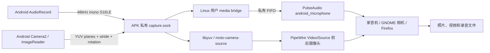

# 麦克风、相机、拍照和录像接入

> 历史研究记录：Phosh 专属实现已于2026-09-23移除。本篇保留共享硬件接口与研究结论；当前代码见 `shared/`、`native/plasma/`、`plasma/`，现行集成见 [40篇](../40-plasma-mobile-integration.md)。旧Phosh路径和已删除的原始日志不再作为可执行入口。

2026-09-23，实机 ZY32MVJS25，Android 16 / Alpine edge / Phosh 0.57。Linux 桌面 **APK 2.5 / versionCode 8**，保留第32篇的网络适配。全局 **SELinux Enforcing**，没有新增相机设备直通或 SELinux 放行规则。

## 使用方式与当前边界

- 应用列表里的 **相机** 是 GNOME Snapshot **51.0**：可切前后摄像头、拍照、录制带声音的视频。首次使用按 Android 提示允许相机和麦克风。
- **录音机** 是 GNOME Sound Recorder **42.0-r2**；42 是该应用本轮核对到的正式发布系列，不能用 GNOME 桌面大版本判断所有应用是否配套。
- 设置 → 声音的输入设备为 **AndroidMicrophone**，普通 PulseAudio 应用使用同一麦克风。`android.monitor` 是扬声器回环，不能当作麦克风。
- Firefox 已启用标准 PipeWire 摄像头入口，网站仍需经过正常授权；相机、麦克风与之前的屏幕共享是不同能力。
- Android 返回菜单新增 **麦克风与相机权限**，可在之前拒绝后重新发起请求；系统设置仍可撤销权限。
- 照片位于安卓 **内部存储/Linux/Pictures/Camera**，视频位于 **内部存储/Linux/Videos/Camera**。Linux 中分别是 `~/Shared/Pictures/Camera`、`~/Shared/Videos/Camera`。录音机使用自身资料目录，可从应用导出录音。

**录像应先点停止、等待保存，再切回安卓。** 离开 Linux 桌面会释放采集硬件；Snapshot 51 在相机突然移除时取消录像，实测该次中断文件缺少 MP4 moov，不能播放。当前未实现后台录像或中断录像修复。

第一版采集为常用 **720p / 目标30fps**，竖屏输出720×1280。照片也取自这一路图像，不是原厂全分辨率摄影。录像使用软件 H.264/AAC，浏览器实测 VP8/Opus；尚未接 MediaCodec 硬编码、HDR、多物理镜头或横屏相机方向动态协商。手机背面贴桌时后摄黑画面是实际输入，前摄已验证真实画面。

## 先研究，再选择接入点

实施前完整比较见 research.md（历史材料已移除），源码地址及哈希见材料目录的 `upstream/sources*.json`。

| 候选 | 本机选择与理由 |
|---|---|
| Termux PulseAudio 输入 | 保留其已工作的 AAudio 输出；已安装 Termux APK 没有 RECORD_AUDIO 声明，不能仅加载 source 模块解决授权 |
| scrcpy 4.0 | 核对 Camera2 / AudioRecord 与分线程传输；借鉴生命周期，未引入 ADB 常驻采集或隐藏 API。源码 Apache-2.0 |
| Droidian / gst-droid / libhybris | 适合 Linux 接管硬件服务的路线；本机保留 Android 主系统和原厂 HAL，选择公开 Android API |
| v4l2loopback / scrcpy webcam / dcamctl | 此轮 GNOME 与浏览器可直接消费 PipeWire，未为此新增内核模块或 `/dev/video*` |
| PulseAudio module-pipe-source | 复用标准 PCM source、混音/音量/客户端连接，LGPL-2.1-or-later；只实现 Android PCM 输入和按需开关 |
| PipeWire 1.6.8 video-src + libyuv | 发布标准 Video/Source；复用 MIT 示例和 BSD-3-Clause 转换库，正确处理 YUV plane stride 与旋转 |
| GNOME Snapshot 51 / Sound Recorder 42 | 保留成熟应用、GStreamer、照片/视频保存；不另外做相机前端 |
| XDG Camera portal / Firefox | 复用既有授权与 PipeWire remote，未关闭浏览器沙箱或给网站自动授权 |

主要来源：[Android Camera2](https://developer.android.com/reference/android/hardware/camera2/package-summary)、[ImageReader](https://developer.android.com/reference/android/media/ImageReader)、[AudioRecord](https://developer.android.com/reference/android/media/AudioRecord)、[采集前台服务类型](https://developer.android.com/develop/background-work/services/fgs/service-types)、[Snapshot 51源码](https://download.gnome.org/sources/snapshot/51/snapshot-51.0.tar.xz)、[Sound Recorder发布目录](https://download.gnome.org/sources/gnome-sound-recorder/)、[PipeWire示例](https://github.com/PipeWire/pipewire/blob/1.6.8/src/examples/video-src.c)、[Camera portal](https://flatpak.github.io/xdg-desktop-portal/docs/doc-org.freedesktop.portal.Camera.html)。

## 桌面和 Android 后端怎样连接

Android 使用普通应用的 CAMERA / RECORD_AUDIO 运行时权限和 `camera|microphone` 前台服务；采集代码不执行 root 命令。APK 可见且 Linux 有消费者才实际打开设备。Android 系统隐私指示保持有效，FGS 通知显示正在使用的设备。`onStop` 关闭采集连接；服务不会自行恢复录音。当前桌面普通应用共用 Linux UID1000，socket 的 UID 检查不是 Linux 应用之间的隔离沙箱。

`CaptureBridge.java` 创建 app 私有目录下的 Unix socket，映射到 `/mnt/android-wayland/capture.sock`，不监听 TCP。校验 peer UID0/1000，限制并发3条连接、请求大小和超时。一次只占用一个实际摄像头、一条 AudioRecord；Linux 的音频服务器可供多个消费者共享麦克风。

`PlatformBridge` 的 `capture-info` 返回可见状态、真实授权状态及前后摄像头的实际输出规格；不会因查询信息就采集。协议版本1：

| 请求 | 返回 |
|---|---|
| `{"op":"microphone"}` | 一行 JSON：`ok=true,rate=48000,channels=1,format=s16le`，随后 PCM；失败返回 error 或断开已开始的流 |
| `{"op":"camera","id":"0"}` | 一行成功 JSON，随后每帧64字节大端 header + 三个 YUV plane；含magic/version/尺寸/旋转/stride/plane长度/Android时间戳 |

Camera2 使用 `acquireLatestImage` 丢弃过时帧，Linux 也只保留最新一帧，避免积压。libyuv 处理 Android420→I420→旋转→BGRA。PipeWire 节点为 `moto.camera.0/1`，`media.class=Video/Source`，提供前后镜头位置属性。消费者开始才连接 Android，停止就断开；后台移除节点，回前台重新发布。

Linux 麦克风使用 `module-pipe-source`，FIFO 为 `/run/user/1000/moto-microphone.pcm`、0600。broker 只在该 source 有未 cork 的 source-output 时启动 AudioRecord，退出消费者后停止并清空遗留 FIFO。默认 source 指向麦克风，输出 `android` 保持原来的私有 tunnel / AAudio 链路。

## 适配过程中解决的问题

1. **PipeWire realtime 导致相机被 SIGKILL。** 结合 strace、内核 signal 调用栈与 portal 属性定位：当前无 RTKit 的容器，Realtime portal 返回 RTTimeUSecMax=0，客户端 module-rt 将 RLIMIT_RTTIME 设为0。对仅用于视频/portal 的 PipeWire 客户端配置 `module.rt=false`，采用普通调度；没有修改全局实时资源限制或 SELinux。见 [PipeWire RT模块](https://docs.pipewire.org/page_module_rt.html)。
2. **预览正常但 MP4 无有效时间戳。** 上游简化示例的 `pts=-1` 不足以供当前 GStreamer 录像。源现在写入每帧收到并转换后的 CLOCK_MONOTONIC 时间；未宣称 Android 传感器曝光时间与音频硬件时钟已精确同步。
3. **中文应用名触发 PA17 JSON exporter 错误。** 消费者检测改为解析 `LC_ALL=C pactl list source-outputs` 的 Source/Corked 字段，避免把该错误变成麦克风反复重载。source 描述采用 ASCII。
4. **浏览器音视频图时钟停滞。** Android 专用 Termux PA 输出实例对 pactl 都无响应；仅重启该实例后 Firefox 同步录制恢复。对照 Termux AAudio sink 和 [Android AAudio线程/关闭约束](https://developer.android.com/ndk/guides/audio/aaudio/aaudio)，存在回调与关闭路径死锁嫌疑，但未取得完整用户栈，不能称根因已经修复。
5. **输出故障自动恢复。** `android-audio watch` 每10秒探测一次，3秒超时、连续两次失败才恢复；验证 PID 的 UID、可执行文件和专用配置参数后才终止进程。flock 保证单监控和启停串行，只恢复专用实例；原 tunnel 自动重连。SIGSTOP 故障注入实测约30.6秒恢复。期间会有音频中断，应用可能需要重试，不能当作无缝会议能力。
6. **Android共享目录因升级失效。** 原 bindfs 需要 `libfuse3.so.3`，当前 edge 包提供 `.so.4`。重新以已核验 bindfs1.18.4 源码、当前 fuse3-dev3.18.3 编译，未伪造 SONAME 软链。init 等待挂载握手后再启动桌面，未挂载底目录保留root所有权，避免继续悄悄写入私有rootfs。双端文件内容已核对。上游：[bindfs](https://github.com/mpartel/bindfs)、[libfuse发布](https://github.com/libfuse/libfuse/releases)。
7. **GNOME输入电平没有实际监听。** 51.0及本轮查询的main对输入设备调用 `pa_stream_set_monitor_stream`，这个参数实际用于选定播放sink-input。对真正的GvcMixerSource跳过该设置，直接录制source；补丁 `gnome-control-center-source-meter.patch` 叠加第32篇网络补丁，保留正常声音面板。依据[PulseAudio官方音量UI接口说明](https://wiki.freedesktop.org/www/Software/PulseAudio/Documentation/Developer/Clients/WritingVolumeControlUIs/)。本轮只修复真实输入设备电平，不宣称所有应用流/输出meter的上游问题已解决。

## 实机验收和明确未覆盖的范围

| 验收 | 证据 / 结果 |
|---|---|
| 前后摄像头 | GNOME相机预览、切换、退出释放；前摄真实画面截图 |
| 拍照 | JPEG720×1280，重启后新照片也实际写入Android共享目录 |
| 正常停止的视频 | `native-front.mp4`：8.431667秒、250帧H.264、AAC44.1kHz单声道；完整解码成功，音轨有非零实际样本 |
| 录音机 | FLAC44.1kHz双声道输出，约40秒可解码；实际物理输入为单声道，不能将应用转换后的双声道称为立体声采集 |
| Firefox | 正常网站授权，前摄+麦克风同步录制；最终样本210帧VP8、389帧Opus、373128个48kHz音频样本；所有track结束 |
| 浏览器文件检查边界 | FFmpeg输出0个解码错误，但解复用结尾仍打印一次 `Error parsing Opus packet header`；保留原始WebM和日志，未声称所有封装器兼容问题已解决 |
| 后台释放 | Android CameraService ActiveCameraClients为空，broker停止麦克风，回前台重新发布 |
| 完整容器停止/启动 | source、摄像头节点、共享挂载自动恢复，无开机自动采集；Android授权保持，NM State=70 |
| 输出服务故障 | 专用PA被SIGSTOP后约30.6秒恢复；重复start不增加watcher |

测试细节在 capture-validation.json（历史材料已移除） 和材料目录。正常MP4检查使用 `ffmpeg -fps_mode passthrough -enc_time_base demux`，避免以默认固定帧时基重采样而产生虚假的重复DTS警告。

尚未验收长会议、回声消除效果、耳机/蓝牙路由、电话音频焦点、长时间音画同步、温控/续航、后台录像、全分辨率拍照和硬件编码。当前30fps是目标格式；实际短片250帧/8.43秒约29.65fps，浏览器样本受负载和启动影响更低。权限允许已实际操作；未把代码中的拒绝处理当作覆盖所有撤权时序的验收。

## 维护、构建与回退

| 本地源 | 部署路径 |
|---|---|
| `phosh/native-apk/src/dev/moto/phosh/CaptureBridge.java`、`CaptureService.java`、Manifest/MainActivity/PlatformBridge | `dev.moto.phosh` APK2.5，沿用原签名 |
| `shared/media/media-bridge.py` | `/usr/local/bin/moto-media-bridge` |
| `shared/media/camera-source.cpp` | `/usr/local/bin/moto-camera-source` |
| `phosh/session-apps` | `/usr/local/bin/moto-phosh-apps`，启动broker |
| `phosh/pipewire-video-clients.conf` | `/etc/pipewire/client.conf.d/50-moto-video.conf` |
| `phosh/firefox-policies.json` | `/usr/lib/firefox/distribution/policies.json`，PipeWire摄像头偏好为可更改default |
| `phosh/android-audio` | Android `/data/adb/moto-phosh/android-audio`，专用输出守护与watchdog |
| `phosh/init.sh` / 本轮bindfs二进制 | `/usr/local/sbin/moto-phosh-init` / `/usr/bin/bindfs` |
| `phosh/gnome-control-center-source-meter.patch` | GNOME51源码叠加网络补丁后重建 `/usr/local/libexec/moto-gnome-control-center`；network-only旧二进制保留 |

Linux编译：`build-base pipewire-dev json-glib-dev libyuv-dev`，命令 `g++ -std=gnu++20 -O2 camera-source.cpp -o moto-camera-source $(pkg-config --cflags --libs libpipewire-0.3 json-glib-1.0) -lyuv -pthread`。运行时保留 `libyuv`。相机/录音机包为 `snapshot snapshot-lang gnome-sound-recorder gnome-sound-recorder-lang`，PipeWire工具为 `pipewire-tools`。

首次为当前用户设置 `~/.config/user-dirs.dirs` 的 Pictures/Videos 到 `~/Shared/Pictures`、`~/Shared/Videos`；此次原文件不存在。迁移其他用户时应合并已有条目，不能覆盖用户目录配置。

APK构建入口 `bash phosh/build-native-apk.sh`。最终APK、Linux文件快照、上游源码索引、构建/验收日志和SHA256在 本轮材料（历史材料已移除）。文件快照不含用户资料、音频cookie和签名私钥，不是完整rootfs，也不是Fastboot刷机包。

回退采集：停用session-apps里的media bridge，终止其进程和camera-source、卸载 `android_microphone` 对应PA模块；需要时恢复APK2.4。保留bindfs ABI修复和既有网络桥。移除PipeWire普通调度配置前应先修复RTKit/Realtime portal，否则相机可能再次被内核终止。回退不会自动删除用户照片、视频和录音。
