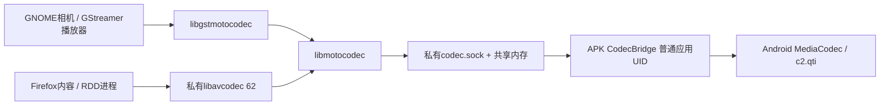

# Linux 应用和 Firefox 接入 Android 硬件编解码

> 改名说明（2026-09-26）：Rungic改名B阶段之后，容器内的`moto-*`包、程序、单元、路径，`MOTO_*`变量和`dev.moto.*`名称改为`rungic-*`、`RUNGIC_*`、`com.rungic.*`；Android侧的名称（APK、`/data/adb/moto-*`、绑定挂载点等）在C阶段改。对照与边界见[70篇](../70-rungic-rebrand.md)。下文按时间记录的内容保留当时的名称。

> 历史研究记录：Phosh 专属实现已于2026-09-23移除。本篇保留共享硬件接口与研究结论；当前代码见 `shared/`、`native/plasma/`、`plasma/`，现行集成见 [40篇](../40-plasma-mobile-integration.md)。旧Phosh路径和已删除的原始日志不再作为可执行入口。

2026-09-23，moto g100s / XT2537-4，Android 16。当前 APK **2.6 / versionCode 9**，Phosh 0.57.0、Snapshot 51、Firefox 154.0-r0、GStreamer 1.28.5、私有 FFmpeg 8.1.2。第[34篇](34-hardware-codec-audit.md)是接入前审计，不能用其“尚未接入”描述当前状态。

## 已接通的范围

Linux GStreamer 应用和 Firefox 已能通过 APK 调用高通 MediaCodec。GNOME 相机有声 H.264 录像、GStreamer H.264/HEVC/VP9 解码、Firefox 网页视频及 H.264 WebCodecs/WebRTC 均有实机证据。**这不等于所有网站、所有浏览器录制 API 都使用硬件，也不等于零复制或已完成实时性能优化。**

| 入口 | 本轮实测 | 边界 |
|---|---|---|
| GStreamer 编码 | H.264/HEVC 各 1920×1080、90帧完整输出 | 8-bit SDR、I420；最长边限制2560；未验4K/HDR |
| GStreamer 解码 | H.264/HEVC 1080p各90帧；VP9 720p120帧；带B帧H.264 720p300帧 | 每帧抽样192个Y/U/V像素与软件结果一致；不是全图逐像素校验 |
| 播放器公共后端 | playbin3自动选中硬件解码，seek、暂停/恢复、EOS通过 | 长时间音画同步、异常媒体与所有播放器操作未全覆盖 |
| GNOME Snapshot 51 | 720×1280两次有声MP4：137帧/约5.5秒、116帧/约4.8秒；高通组件帧数吻合 | 仍需前台录制，先停止保存再回安卓；AAC由软件编码 |
| Firefox WebCodecs | H.264 640×360，60帧编码→60帧解码，两个关键帧、时间戳完整 | 使用`hardwareAcceleration: no-preference`；本Alpine构建的`prefer-hardware`分类路径不支持此适配 |
| Firefox WebRTC | 本机双PeerConnection协商H.264并connected；155帧编码、111帧显示端解码；高通组件实际开启/释放 | 7.5秒短测有43帧丢弃，约20fps发送/13fps接收；不能宣称满30fps或长会议验收完成 |
| Firefox MediaRecorder | WebM VP8/Opus仍可用；MP4 AVC类型查询false | VP8为软件编码，本机未发现可用VP8硬件组件；不要把WebCodecs成功写成MediaRecorder硬编成功 |

全局 SELinux 保持 **Enforcing**。没有替换统一 Mesa/KGSL，没有给浏览器关闭内容/RDD沙箱，没有给容器开放原厂V4L2设备。

## 先研究，再选择接口

本轮延续[29篇](29-reuse-research.md)与34篇，并保存实施前判断（历史材料已移除）。

- 原厂video32/33支持DMABUF的REQBUFS，但MMAP/USERPTR返回EINVAL。GStreamer通用stateful V4L2路径不能只靠映射节点即用；双队列缓冲导入、厂商控制仍需适配。此次优先采用已实测可工作的公开MediaCodec。
- 复用[GStreamer 1.28.5 androidmedia](https://github.com/GStreamer/gstreamer/tree/1.28.5/subprojects/gst-plugins-bad/sys/androidmedia)的标准Decoder/Encoder生命周期和已有解析/封装层；Android/JNI插件不能直接加载进Alpine musl，因此增加薄IPC适配。
- [Android MediaCodec](https://developer.android.com/reference/android/media/MediaCodec)、[SharedMemory](https://developer.android.com/reference/android/os/SharedMemory)由普通应用调用。未复制闭源高通实现，也不需要libhybris加载整套Android库。
- [Snapshot 51](https://gitlab.gnome.org/GNOME/snapshot/-/tree/51.0)有标准encodebin，增加真实硬件工厂名识别即可保留其录像与硬件开关设计。
- Firefox不使用GStreamer。核验**FIREFOX_154_0_RELEASE**的[PDM](https://github.com/mozilla-firefox/firefox/blob/FIREFOX_154_0_RELEASE/dom/media/platforms/PDMFactory.cpp)、[FFmpeg encoder module](https://github.com/mozilla-firefox/firefox/blob/FIREFOX_154_0_RELEASE/dom/media/platforms/ffmpeg/FFmpegEncoderModule.cpp)和实际Alpine APKBUILD，选择私有FFmpeg适配，保留发行版Firefox。
- 早期阅读过Firefox main，之后发现实际154版本的远程编码pref不同；最终依据release源码。不要复制早期实验的`media.use-remote-encoder.video.platform/software`或强制硬件gfx偏好作为部署方案。

固定源码、版本、SHA256保存在`.work/refs/phosh-codec-integration-20260923/upstream/`。桥接与GStreamer胶水为MIT；FFmpeg适配为LGPL-2.1-or-later，本轮启用x264/x265的FFmpeg整体构建受GPL条款约束；Phosh/Snapshot补丁沿用GPL-3.0-or-later，Firefox/mobile-config修改沿用对应上游许可。复现/分发需一并保留原许可证和对应源码。

## 实际数据路径



服务端为CodecBridge.java（历史材料已移除），随MainActivity建立/关闭。APK私有`files/tmp/codec.sock`沿现有目录挂载成为容器`/mnt/android-wayland/codec.sock`。校验SO_PEERCRED仅允许UID0/1000；最多64条broker连接、6个活动codec。只提供编解码固定命令，不接受任意文件、shell或网络请求。

客户端[codec-client.c](../../shared/media/codec-client.c)通过broker申请socketpair和32MiB SharedMemory FD，上下半区各16MiB传输入与输出，控制消息带长度、帧ID和微秒时间戳。FRAME、DRAIN、FLUSH、CLOSE对应标准生命周期；消费者ACK后复用共享区域。检查长度、尺寸、FD类型和超时。Android SharedMemory可能是`st_size=0`的ashmem字符设备，不能套用只接受普通memfd的判断。

硬件编码使用MediaCodec输入Image；硬件解码输出Image按row/pixel stride及crop复制到I420。**存在CPU颜色平面复制**，不把共享内存传输称为GPU零复制。时间戳与帧ID映射支持B帧；配置数据使用真实SPS/PPS/VPS。视频封装、音频编解码继续交给成熟Linux组件。

消费者在seek时返回FLUSHING，客户端仍须ACK并读到DONE才能发下一条FLUSH；否则上一响应会被当作下一响应。本轮发现并修复了此协议错位，最终playbin3 seek/暂停测试通过。

## GStreamer 和相机

[gst-moto-codec.c](../../shared/media/gst-moto-codec.c)注册`motoh264dec`、`motoh265dec`、`motovp9dec`、`motoh264enc`、`motoh265enc`，rank为PRIMARY+32。安装位置为`/usr/lib/gstreamer-1.0/libgstmotocodec.so`，共享传输库在`/usr/local/lib/moto-codec/`。可使用`gst-inspect-1.0 motoh264dec`检查；编译入口build-codec-linux.sh（历史材料已移除）。

[Snapshot补丁](../../shared/media/snapshot-moto-codec.patch)增加工厂识别，开启硬件编码时选择motoh264enc、关闭时将其rank设为NONE，避免开关只有外观没有实际行为。Android PipeWire摄像头单独设置`provide-clock=false / do-timestamp=true`，录像增减音频源时沿用系统时钟。曾出现EOS等待/零字节文件，调试栈和前后台切换记录保留；不能仅凭最后一次成功把所有早期问题都归因于时钟。后台采集限制仍按33篇执行。

定制二进制`/usr/local/libexec/moto-snapshot`，`/usr/bin/snapshot`为小包装入口；原二进制保存为`/usr/bin/snapshot.pre-moto-codec`。用户视频仍存Android可见`Linux/Videos/Camera`。

## Firefox：怎样保留沙箱又接到硬件

[FFmpeg适配](../../shared/media/ffmpeg-moto-codec.c)嵌入私有FFmpeg8.1.2，通过FFmpeg既有接口进入Firefox。解码器保留CPU帧分配回调，支持H.264/HEVC/VP9；混合编码器`h264_moto_auto / hevc_moto_auto`打开硬件失败时回退到软件。`h264_moto / hevc_moto`是明确要求硬件的命令行编码器。私有库内将x264编码器名设为`libx264_sw`，避免Firefox直接按名字优先选x264绕过混合编码器；系统FFmpeg没有改名。

Firefox的内容/RDD沙箱禁止新建这类路径连接。firefox包装脚本（历史材料已移除）预加载小型传输库，在沙箱建立前预连仅具编解码能力的broker；fork-server派生子进程时通过pthread_atfork各建独立broker。后续通过既有FD通信，无需放宽sandbox规则。

实测仅设LD_LIBRARY_PATH/LD_PRELOAD不足：Firefox部分内容进程会从应用目录/默认路径另行加载发行版FFmpeg，RDD硬解可用不代表内容编码可用。最终将私有构建的以下四个运行库副本放入`/usr/lib/firefox/`，与启动包装脚本使用同一路径：

```
libavcodec.so.62
libavutil.so.60
libswresample.so.6
libswscale.so.9
```

**桌面入口补修**：Alpine的`firefox.desktop`三个Exec默认绝对指向`/usr/lib/firefox/firefox`，必须一并接到包装入口。以linux用户运行`python3 /usr/local/bin/moto-install-firefox-launcher`（源码install-firefox-launcher.py（历史材料已移除）），生成`~/.local/share/applications/firefox.desktop`同ID覆盖。此前仅验证命令行是遗漏；桌面启动修复及复测（历史材料已移除）为最新部署要求。

完整私有FFmpeg安装在`/usr/local/lib/moto-codec/ffmpeg/`；不覆盖`/usr/lib/libavcodec*`或Mesa。实际构建配置见build-codec-ffmpeg.sh（历史材料已移除）。

默认偏好（历史材料已移除）选择PEM WebRTC编码路径以及私有FFmpeg视频后端。这里的“hybrid”沿用CPU帧接口，Firefox日志可能把它分到software类别，必须结合`MotoCodec OPEN c2.qti.*`和真实帧数判断；不伪造系统硬件能力。`no-preference`的WebCodecs可用，不承诺`prefer-hardware`或网页`powerEfficient`能正确识别。

软件回退需将内部解码器公开API释放的`private_ref`重新附着到外层帧，并将当前尺寸/像素格式同步给Firefox分配回调。本轮故障注入发现断言，修复保留在源码；相关最终验收见材料索引。最终故障注入后CLI H.264软件编解码30帧、Firefox视频播放/seek/暂停和WebCodecs60帧编解码均通过。软件回退只覆盖打开时失败，不保证正在编码中APK退出后无缝续接同一流。

## 桌面体验的三项修正

1. **底部留白恢复**：Phosh原生home高度15逻辑像素，早期防安卓手势补丁改成45并强制白底。本轮按用户要求恢复15，去掉额外margin和白底，保留外层沉浸模式及顶部挖孔safe area。实机第一次底部上滑仍停留在Linux桌面APK。
2. **防止无密码锁死**：linux账户没有可用密码。设置`org.gnome.desktop.lockdown disable-lock-screen=true`，让Phosh手动动作、中央锁屏管理和ScreenSaver.Lock入口都遵从；仍由Android系统锁屏管理整机访问。本轮未设置或更改账户密码。
3. **Firefox移动UA**：mobile-config默认UA调整为Android16/Mobile，保留其站点兼容覆盖；实际www.bilibili.com已跳转m.bilibili.com。站点是否重定向仍由其服务端决定。

补丁：phosh-fullscreen-unlocked.patch（历史材料已移除）、mobile-config-user-agent.patch（历史材料已移除）。前者是叠加在30篇已部署Phosh源码上的增量，不能直接应用到纯上游；25/27篇旧的加高底栏补丁是历史状态，按当前完整源归档重建。体验修正与截图说明（历史材料已移除）。

## 验收材料、维护和回退

完整索引见本轮材料（历史材料已移除）。最终通过的证据与早期失败日志分别标注，不能把初始软件编码的WebCodecs结果当作硬件证据。

**验收流程补正**：本轮曾在日常profile运行Marionette并遗留自动化偏好，其中测试焦点模式导致用户地址栏输入崩溃。36篇已清理并用实际屏幕键盘复测。今后只对显式独立测试profile运行自动化；材料目录中的三个codec浏览器脚本已增加连接前检查。旧归档不含该保护，使用外层最新脚本。硬件帧数证据仍有效，但不能据此认定日常输入体验已验收。详见[36：输入修复](../36-firefox-input-fix.md)。

升级Firefox/APK或Alpine后，需要重新核验包装脚本、应用目录私有库、FFmpeg ABI、mobile-config默认UA和插件。这里是针对当前154/FFmpeg62的集成，尚未提供跨版本自动更新机制。`MOTO_CODEC_DISABLE=1`只用于指定进程的回退测试，正常启动不设置它。

回退编解码时先退出Firefox、相机和播放器：恢复Snapshot原二进制；移走`libgstmotocodec.so`；移走Firefox应用目录中的上述四个新增库、`defaults/pref/moto-codec.js`，将`/usr/bin/firefox`恢复发行版指向实际程序的入口。删除或恢复本轮生成的用户desktop覆盖，保留用户profile和拍摄文件。若不再有引用，再移除`/usr/local/lib/moto-codec`；不要移走系统FFmpeg/Mesa。APK2.5可作为硬件桥前版本回退，保留既有安装数据。

底部/锁屏/UA可以单独保留，不必随codec回退；Phosh旧二进制另存`phosh.pre-codec-ui`。若未来要启用独立Linux锁屏，先设置能用的认证，再取消disable-lock-screen，避免再次锁死。

剩余工作：通话端到端延迟与帧率、后台录像、长时间音画同步、编码途中硬件故障恢复、更多分辨率/动态码率、HDR/10-bit/DRM，以及零复制。此次**未更新Fastboot ROM或一键完整重装包**。
